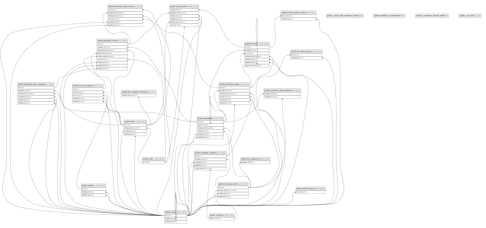

# gns_quotation

## Tables

| Name                                                                          | Columns | Comment                                                                                                                                                                     | Type       |
| ----------------------------------------------------------------------------- | ------- | --------------------------------------------------------------------------------------------------------------------------------------------------------------------------- | ---------- |
| [public.users](public.users.md)                                               | 10      |                                                                                                                                                                             | BASE TABLE |
| [public.units](public.units.md)                                               | 4       |                                                                                                                                                                             | BASE TABLE |
| [public.company_client](public.company_client.md)                             | 14      |                                                                                                                                                                             | BASE TABLE |
| [public.company_contacts](public.company_contacts.md)                         | 12      |                                                                                                                                                                             | BASE TABLE |
| [public.vendors](public.vendors.md)                                           | 10      |                                                                                                                                                                             | BASE TABLE |
| [public.items](public.items.md)                                               | 11      |                                                                                                                                                                             | BASE TABLE |
| [public.vendor_products](public.vendor_products.md)                           | 12      |                                                                                                                                                                             | BASE TABLE |
| [public.item_request_matches](public.item_request_matches.md)                 | 5       |                                                                                                                                                                             | BASE TABLE |
| [public.quotations](public.quotations.md)                                     | 27      |                                                                                                                                                                             | BASE TABLE |
| [public.quotation_items](public.quotation_items.md)                           | 30      |                                                                                                                                                                             | BASE TABLE |
| [public.purchase_orders](public.purchase_orders.md)                           | 19      |                                                                                                                                                                             | BASE TABLE |
| [public.purchase_order_items](public.purchase_order_items.md)                 | 25      |                                                                                                                                                                             | BASE TABLE |
| [public.invoices](public.invoices.md)                                         | 22      |                                                                                                                                                                             | BASE TABLE |
| [public.invoice_items](public.invoice_items.md)                               | 22      |                                                                                                                                                                             | BASE TABLE |
| [public.v_items_with_cheapest_vendor](public.v_items_with_cheapest_vendor.md) | 10      | Procurement lookup: for each active item, shows vendor with lowest cost_price. Items without a vendor_product still appear with vendor_id NULL.                             | VIEW       |
| [public.countries](public.countries.md)                                       | 3       |                                                                                                                                                                             | BASE TABLE |
| [public.doc_sequences](public.doc_sequences.md)                               | 5       | Running sequence per (doc_type, company, year). UPSERT atomic via fn_next_doc_no for race-safe number generation.                                                           | BASE TABLE |
| [public.quotation_reconciliation](public.quotation_reconciliation.md)         | 7       | Reconciliation check: header total vs SUM items. Non-zero diff = inconsistency.                                                                                             | VIEW       |
| [public.quotation_status_history](public.quotation_status_history.md)         | 7       | Quotation status change timeline. Populated by trg_log_quotation_creation (initial) and fn_change_quotation_status (subsequent). Used by FE Detail page to render timeline. | BASE TABLE |
| [public.quotation_item_requests](public.quotation_item_requests.md)           | 19      |                                                                                                                                                                             | BASE TABLE |
| [public.v_quotation_request_audit](public.v_quotation_request_audit.md)       | 27      |                                                                                                                                                                             | VIEW       |

## Stored procedures and functions

| Name                                             | ReturnType | Arguments                                                                                                                                                                                                                                                                                                                                             | Type     |
| ------------------------------------------------ | ---------- | ----------------------------------------------------------------------------------------------------------------------------------------------------------------------------------------------------------------------------------------------------------------------------------------------------------------------------------------------------- | -------- |
| public.set_limit                                 | float4     | real                                                                                                                                                                                                                                                                                                                                                  | FUNCTION |
| public.show_limit                                | float4     |                                                                                                                                                                                                                                                                                                                                                       | FUNCTION |
| public.show_trgm                                 | _text      | text                                                                                                                                                                                                                                                                                                                                                  | FUNCTION |
| public.similarity                                | float4     | text, text                                                                                                                                                                                                                                                                                                                                            | FUNCTION |
| public.similarity_op                             | bool       | text, text                                                                                                                                                                                                                                                                                                                                            | FUNCTION |
| public.word_similarity                           | float4     | text, text                                                                                                                                                                                                                                                                                                                                            | FUNCTION |
| public.word_similarity_op                        | bool       | text, text                                                                                                                                                                                                                                                                                                                                            | FUNCTION |
| public.word_similarity_commutator_op             | bool       | text, text                                                                                                                                                                                                                                                                                                                                            | FUNCTION |
| public.similarity_dist                           | float4     | text, text                                                                                                                                                                                                                                                                                                                                            | FUNCTION |
| public.word_similarity_dist_op                   | float4     | text, text                                                                                                                                                                                                                                                                                                                                            | FUNCTION |
| public.word_similarity_dist_commutator_op        | float4     | text, text                                                                                                                                                                                                                                                                                                                                            | FUNCTION |
| public.gtrgm_in                                  | gtrgm      | cstring                                                                                                                                                                                                                                                                                                                                               | FUNCTION |
| public.gtrgm_out                                 | cstring    | gtrgm                                                                                                                                                                                                                                                                                                                                                 | FUNCTION |
| public.gtrgm_consistent                          | bool       | internal, text, smallint, oid, internal                                                                                                                                                                                                                                                                                                               | FUNCTION |
| public.gtrgm_distance                            | float8     | internal, text, smallint, oid, internal                                                                                                                                                                                                                                                                                                               | FUNCTION |
| public.gtrgm_compress                            | internal   | internal                                                                                                                                                                                                                                                                                                                                              | FUNCTION |
| public.gtrgm_decompress                          | internal   | internal                                                                                                                                                                                                                                                                                                                                              | FUNCTION |
| public.gtrgm_penalty                             | internal   | internal, internal, internal                                                                                                                                                                                                                                                                                                                          | FUNCTION |
| public.gtrgm_picksplit                           | internal   | internal, internal                                                                                                                                                                                                                                                                                                                                    | FUNCTION |
| public.gtrgm_union                               | gtrgm      | internal, internal                                                                                                                                                                                                                                                                                                                                    | FUNCTION |
| public.gtrgm_same                                | internal   | gtrgm, gtrgm, internal                                                                                                                                                                                                                                                                                                                                | FUNCTION |
| public.gin_extract_value_trgm                    | internal   | text, internal                                                                                                                                                                                                                                                                                                                                        | FUNCTION |
| public.gin_extract_query_trgm                    | internal   | text, internal, smallint, internal, internal, internal, internal                                                                                                                                                                                                                                                                                      | FUNCTION |
| public.gin_trgm_consistent                       | bool       | internal, smallint, text, integer, internal, internal, internal, internal                                                                                                                                                                                                                                                                             | FUNCTION |
| public.gin_trgm_triconsistent                    | char       | internal, smallint, text, integer, internal, internal, internal                                                                                                                                                                                                                                                                                       | FUNCTION |
| public.strict_word_similarity                    | float4     | text, text                                                                                                                                                                                                                                                                                                                                            | FUNCTION |
| public.strict_word_similarity_op                 | bool       | text, text                                                                                                                                                                                                                                                                                                                                            | FUNCTION |
| public.strict_word_similarity_commutator_op      | bool       | text, text                                                                                                                                                                                                                                                                                                                                            | FUNCTION |
| public.strict_word_similarity_dist_op            | float4     | text, text                                                                                                                                                                                                                                                                                                                                            | FUNCTION |
| public.strict_word_similarity_dist_commutator_op | float4     | text, text                                                                                                                                                                                                                                                                                                                                            | FUNCTION |
| public.gtrgm_options                             | void       | internal                                                                                                                                                                                                                                                                                                                                              | FUNCTION |
| public.set_updated_at                            | trigger    |                                                                                                                                                                                                                                                                                                                                                       | FUNCTION |
| public.set_updated_at_no_version                 | trigger    |                                                                                                                                                                                                                                                                                                                                                       | FUNCTION |
| public.trg_fn_sync_vendor_cost                   | trigger    |                                                                                                                                                                                                                                                                                                                                                       | FUNCTION |
| public.fn_suggest_selling_prices                 | record     | p_item_id bigint, p_limit integer DEFAULT 5                                                                                                                                                                                                                                                                                                           | FUNCTION |
| public.fn_search_items                           | record     | p_q text, p_min_score real DEFAULT 0.3, p_limit integer DEFAULT 10                                                                                                                                                                                                                                                                                    | FUNCTION |
| public.fn_search_items_by_vendor                 | record     | p_vendor_id bigint, p_limit integer DEFAULT 50                                                                                                                                                                                                                                                                                                        | FUNCTION |
| public.fn_match_request                          | record     | p_req_text text, p_limit integer DEFAULT 5                                                                                                                                                                                                                                                                                                            | FUNCTION |
| public.trg_fn_learn_match                        | trigger    |                                                                                                                                                                                                                                                                                                                                                       | FUNCTION |
| public.trg_fn_inherit_quotation_discount         | trigger    |                                                                                                                                                                                                                                                                                                                                                       | FUNCTION |
| public.trg_fn_inherit_po_discount                | trigger    |                                                                                                                                                                                                                                                                                                                                                       | FUNCTION |
| public.trg_fn_po_inherit_quotation_discount      | trigger    |                                                                                                                                                                                                                                                                                                                                                       | FUNCTION |
| public.trg_fn_protect_quotation_discount         | trigger    |                                                                                                                                                                                                                                                                                                                                                       | FUNCTION |
| public.trg_fn_cascade_quotation_discount         | trigger    |                                                                                                                                                                                                                                                                                                                                                       | FUNCTION |
| public.fn_search_clients                         | record     | p_q text, p_min_score real DEFAULT 0.3, p_limit integer DEFAULT 10                                                                                                                                                                                                                                                                                    | FUNCTION |
| public.fn_month_to_roman                         | text       | p_month integer                                                                                                                                                                                                                                                                                                                                       | FUNCTION |
| public.fn_next_doc_no                            | text       | p_doc_type character varying, p_company_id bigint                                                                                                                                                                                                                                                                                                     | FUNCTION |
| public.fn_search_vendors                         | record     | p_q text, p_min_score real DEFAULT 0.3, p_limit integer DEFAULT 10                                                                                                                                                                                                                                                                                    | FUNCTION |
| public.fn_create_quotation                       | int8       | p_company_client_id bigint, p_contact_id bigint, p_client_ref_no text, p_vessel_name text, p_payment_terms text, p_validity_days integer, p_discount_pct numeric, p_shipping_address text, p_shipping_days integer, p_shipping_cost numeric, p_items jsonb, p_created_by bigint, p_notes text DEFAULT NULL::text, p_status text DEFAULT 'draft'::text | FUNCTION |
| public.trg_fn_log_quotation_creation             | trigger    |                                                                                                                                                                                                                                                                                                                                                       | FUNCTION |
| public.fn_change_quotation_status                | void       | p_quotation_id bigint, p_new_status text, p_user_id bigint, p_note text DEFAULT NULL::text                                                                                                                                                                                                                                                            | FUNCTION |
| public.fn_update_quotation                       | int8       | p_id bigint, p_client_ref_no text, p_vessel_name text, p_payment_terms text, p_validity_days integer, p_discount_pct numeric, p_shipping_address text, p_shipping_days integer, p_shipping_cost numeric, p_items jsonb, p_user_id bigint, p_notes text DEFAULT NULL::text                                                                             | FUNCTION |
| public.fn_create_purchase_order                  | int8       | p_quotation_id bigint, p_user_id bigint                                                                                                                                                                                                                                                                                                               | FUNCTION |
| public.fn_create_invoice                         | int8       | p_po_id bigint, p_user_id bigint                                                                                                                                                                                                                                                                                                                      | FUNCTION |
| public.fn_change_po_status                       | void       | p_po_id bigint, p_new_status text, p_user_id bigint                                                                                                                                                                                                                                                                                                   | FUNCTION |
| public.fn_update_po_items                        | void       | p_po_id bigint, p_user_id bigint, p_discount_pct numeric, p_notes text, p_shipping_address text, p_shipping_days integer, p_shipping_cost numeric, p_items jsonb                                                                                                                                                                                      | FUNCTION |
| public.fn_change_invoice_status                  | void       | p_invoice_id bigint, p_target text, p_user_id bigint                                                                                                                                                                                                                                                                                                  | FUNCTION |
| public.trg_fn_qir_lock_parent                    | trigger    |                                                                                                                                                                                                                                                                                                                                                       | FUNCTION |
| public.fn_update_quotation_versioned             | int4       | p_id bigint, p_if_match integer, p_client_ref_no text, p_vessel_name text, p_payment_terms text, p_validity_days integer, p_discount_pct numeric, p_shipping_address text, p_shipping_days integer, p_shipping_cost numeric, p_items jsonb, p_user_id bigint, p_notes text DEFAULT NULL::text                                                         | FUNCTION |
| public.fn_update_po_items_versioned              | int4       | p_po_id bigint, p_if_match integer, p_user_id bigint, p_discount_pct numeric, p_notes text, p_shipping_address text, p_shipping_days integer, p_shipping_cost numeric, p_items jsonb                                                                                                                                                                  | FUNCTION |

## Relations

---

> Generated by [tbls](https://github.com/k1LoW/tbls)
