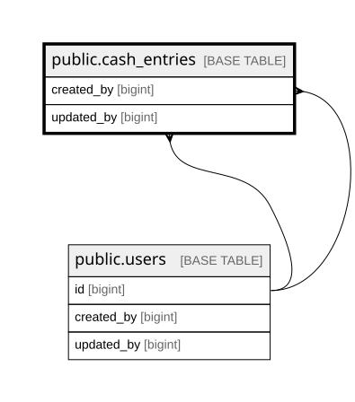

# public.cash_entries

## Columns

| Name        | Type                     | Default                                  | Nullable | Children | Parents                         | Comment |
| ----------- | ------------------------ | ---------------------------------------- | -------- | -------- | ------------------------------- | ------- |
| id          | bigint                   | nextval('cash_entries_id_seq'::regclass) | false    |          |                                 |         |
| entry_date  | date                     |                                          | false    |          |                                 |         |
| direction   | varchar(3)               |                                          | false    |          |                                 |         |
| category    | varchar(60)              |                                          | false    |          |                                 |         |
| amount      | numeric(18,2)            |                                          | false    |          |                                 |         |
| description | varchar(500)             |                                          | false    |          |                                 |         |
| row_version | integer                  | 0                                        | false    |          |                                 |         |
| created_by  | bigint                   |                                          | false    |          | [public.users](public.users.md) |         |
| updated_by  | bigint                   |                                          | true     |          | [public.users](public.users.md) |         |
| created_at  | timestamp with time zone | now()                                    | false    |          |                                 |         |
| updated_at  | timestamp with time zone | now()                                    | false    |          |                                 |         |

## Constraints

| Name                              | Type        | Definition                                                                                             |
| --------------------------------- | ----------- | ------------------------------------------------------------------------------------------------------ |
| cash_entries_amount_check         | CHECK       | CHECK ((amount > (0)::numeric))                                                                        |
| cash_entries_amount_not_null      | n           | NOT NULL amount                                                                                        |
| cash_entries_category_check       | CHECK       | CHECK ((btrim((category)::text) <> ''::text))                                                          |
| cash_entries_category_not_null    | n           | NOT NULL category                                                                                      |
| cash_entries_created_at_not_null  | n           | NOT NULL created_at                                                                                    |
| cash_entries_created_by_not_null  | n           | NOT NULL created_by                                                                                    |
| cash_entries_description_check    | CHECK       | CHECK ((btrim((description)::text) <> ''::text))                                                       |
| cash_entries_description_not_null | n           | NOT NULL description                                                                                   |
| cash_entries_direction_check      | CHECK       | CHECK (((direction)::text = ANY ((ARRAY['in'::character varying, 'out'::character varying])::text[]))) |
| cash_entries_direction_not_null   | n           | NOT NULL direction                                                                                     |
| cash_entries_entry_date_not_null  | n           | NOT NULL entry_date                                                                                    |
| cash_entries_id_not_null          | n           | NOT NULL id                                                                                            |
| cash_entries_row_version_not_null | n           | NOT NULL row_version                                                                                   |
| cash_entries_updated_at_not_null  | n           | NOT NULL updated_at                                                                                    |
| cash_entries_created_by_fkey      | FOREIGN KEY | FOREIGN KEY (created_by) REFERENCES users(id) ON DELETE RESTRICT                                       |
| cash_entries_updated_by_fkey      | FOREIGN KEY | FOREIGN KEY (updated_by) REFERENCES users(id) ON DELETE RESTRICT                                       |
| cash_entries_pkey                 | PRIMARY KEY | PRIMARY KEY (id)                                                                                       |

## Indexes

| Name                  | Definition                                                                                       |
| --------------------- | ------------------------------------------------------------------------------------------------ |
| cash_entries_pkey     | CREATE UNIQUE INDEX cash_entries_pkey ON public.cash_entries USING btree (id)                    |
| idx_cash_entries_date | CREATE INDEX idx_cash_entries_date ON public.cash_entries USING btree (entry_date DESC, id DESC) |

## Triggers

| Name                        | Definition                                                                                                                     |
| --------------------------- | ------------------------------------------------------------------------------------------------------------------------------ |
| trg_cash_entries_updated_at | CREATE TRIGGER trg_cash_entries_updated_at BEFORE UPDATE ON public.cash_entries FOR EACH ROW EXECUTE FUNCTION set_updated_at() |

## Relations

---

> Generated by [tbls](https://github.com/k1LoW/tbls)
