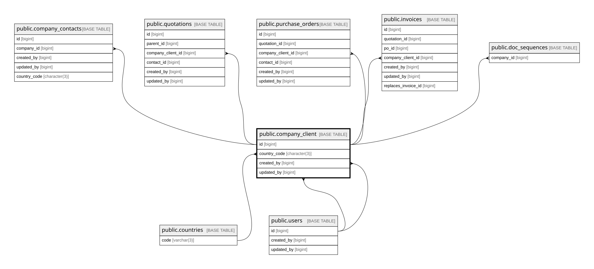

# public.company_client

## Columns

| Name            | Type                     | Default                                    | Nullable | Children                                                                                                                                                                                                                                  | Parents                                 | Comment                                                               |
| --------------- | ------------------------ | ------------------------------------------ | -------- | ----------------------------------------------------------------------------------------------------------------------------------------------------------------------------------------------------------------------------------------- | --------------------------------------- | --------------------------------------------------------------------- |
| id              | bigint                   | nextval('company_client_id_seq'::regclass) | false    | [public.company_contacts](public.company_contacts.md) [public.quotations](public.quotations.md) [public.purchase_orders](public.purchase_orders.md) [public.invoices](public.invoices.md) [public.doc_sequences](public.doc_sequences.md) |                                         |                                                                       |
| number          | varchar(10)              |                                            | true     |                                                                                                                                                                                                                                           |                                         |                                                                       |
| name            | varchar(255)             |                                            | false    |                                                                                                                                                                                                                                           |                                         |                                                                       |
| npwp            | varchar(20)              |                                            | true     |                                                                                                                                                                                                                                           |                                         |                                                                       |
| address         | text                     |                                            | true     |                                                                                                                                                                                                                                           |                                         |                                                                       |
| email           | varchar(255)             |                                            | true     |                                                                                                                                                                                                                                           |                                         |                                                                       |
| country_code    | character(3)             | 'IDN'::bpchar                              | true     |                                                                                                                                                                                                                                           | [public.countries](public.countries.md) |                                                                       |
| tku_id          | varchar(30)              |                                            | true     |                                                                                                                                                                                                                                           |                                         |                                                                       |
| is_active       | boolean                  | true                                       | false    |                                                                                                                                                                                                                                           |                                         |                                                                       |
| created_by      | bigint                   |                                            | false    |                                                                                                                                                                                                                                           | [public.users](public.users.md)         |                                                                       |
| updated_by      | bigint                   |                                            | true     |                                                                                                                                                                                                                                           | [public.users](public.users.md)         |                                                                       |
| created_at      | timestamp with time zone | now()                                      | false    |                                                                                                                                                                                                                                           |                                         |                                                                       |
| updated_at      | timestamp with time zone | now()                                      | false    |                                                                                                                                                                                                                                           |                                         |                                                                       |
| logo_object_key | text                     |                                            | true     |                                                                                                                                                                                                                                           |                                         | MinIO object key inside bucket client-logos. NULL = no logo uploaded. |

## Constraints

| Name                               | Type        | Definition                                                               |
| ---------------------------------- | ----------- | ------------------------------------------------------------------------ |
| company_client_created_at_not_null | n           | NOT NULL created_at                                                      |
| company_client_created_by_not_null | n           | NOT NULL created_by                                                      |
| company_client_id_not_null         | n           | NOT NULL id                                                              |
| company_client_is_active_not_null  | n           | NOT NULL is_active                                                       |
| company_client_name_not_null       | n           | NOT NULL name                                                            |
| company_client_updated_at_not_null | n           | NOT NULL updated_at                                                      |
| company_client_created_by_fkey     | FOREIGN KEY | FOREIGN KEY (created_by) REFERENCES users(id) ON DELETE RESTRICT         |
| company_client_updated_by_fkey     | FOREIGN KEY | FOREIGN KEY (updated_by) REFERENCES users(id) ON DELETE RESTRICT         |
| company_client_pkey                | PRIMARY KEY | PRIMARY KEY (id)                                                         |
| company_client_country_code_fkey   | FOREIGN KEY | FOREIGN KEY (country_code) REFERENCES countries(code) ON DELETE RESTRICT |

## Indexes

| Name                         | Definition                                                                                       |
| ---------------------------- | ------------------------------------------------------------------------------------------------ |
| company_client_pkey          | CREATE UNIQUE INDEX company_client_pkey ON public.company_client USING btree (id)                |
| idx_company_client_name_trgm | CREATE INDEX idx_company_client_name_trgm ON public.company_client USING gin (name gin_trgm_ops) |

## Triggers

| Name                          | Definition                                                                                                                                    |
| ----------------------------- | --------------------------------------------------------------------------------------------------------------------------------------------- |
| trg_company_client_updated_at | CREATE TRIGGER trg_company_client_updated_at BEFORE UPDATE ON public.company_client FOR EACH ROW EXECUTE FUNCTION set_updated_at_no_version() |

## Relations

---

> Generated by [tbls](https://github.com/k1LoW/tbls)
