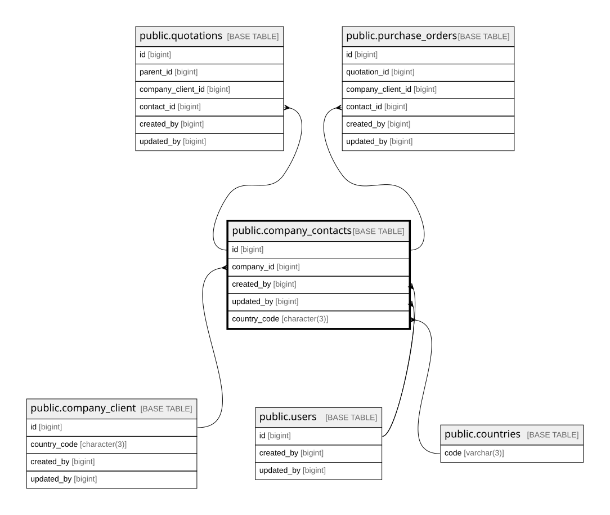

# public.company_contacts

## Columns

| Name         | Type                     | Default                                      | Nullable | Children                                                                                      | Parents                                           | Comment                                                                                                                                   |
| ------------ | ------------------------ | -------------------------------------------- | -------- | --------------------------------------------------------------------------------------------- | ------------------------------------------------- | ----------------------------------------------------------------------------------------------------------------------------------------- |
| id           | bigint                   | nextval('company_contacts_id_seq'::regclass) | false    | [public.quotations](public.quotations.md) [public.purchase_orders](public.purchase_orders.md) |                                                   |                                                                                                                                           |
| company_id   | bigint                   |                                              | false    |                                                                                               | [public.company_client](public.company_client.md) |                                                                                                                                           |
| name         | varchar(255)             |                                              | false    |                                                                                               |                                                   |                                                                                                                                           |
| email        | varchar(255)             |                                              | true     |                                                                                               |                                                   |                                                                                                                                           |
| phone        | varchar(50)              |                                              | true     |                                                                                               |                                                   |                                                                                                                                           |
| title        | varchar(100)             |                                              | true     |                                                                                               |                                                   |                                                                                                                                           |
| is_active    | boolean                  | true                                         | false    |                                                                                               |                                                   |                                                                                                                                           |
| created_by   | bigint                   |                                              | false    |                                                                                               | [public.users](public.users.md)                   |                                                                                                                                           |
| updated_by   | bigint                   |                                              | true     |                                                                                               | [public.users](public.users.md)                   |                                                                                                                                           |
| created_at   | timestamp with time zone | now()                                        | false    |                                                                                               |                                                   |                                                                                                                                           |
| updated_at   | timestamp with time zone | now()                                        | false    |                                                                                               |                                                   |                                                                                                                                           |
| country_code | character(3)             | 'IDN'::bpchar                                | false    |                                                                                               | [public.countries](public.countries.md)           | ISO 3166 alpha-3 country code for phone dial code prefix. FK to countries(code). Default IDN. Same format as company_client.country_code. |

## Constraints

| Name                                   | Type        | Definition                                                                                                                                                                                      | Comment                                                                                                                            |
| -------------------------------------- | ----------- | ----------------------------------------------------------------------------------------------------------------------------------------------------------------------------------------------- | ---------------------------------------------------------------------------------------------------------------------------------- |
| company_contacts_company_id_not_null   | n           | NOT NULL company_id                                                                                                                                                                             |                                                                                                                                    |
| company_contacts_country_code_not_null | n           | NOT NULL country_code                                                                                                                                                                           |                                                                                                                                    |
| company_contacts_created_at_not_null   | n           | NOT NULL created_at                                                                                                                                                                             |                                                                                                                                    |
| company_contacts_created_by_not_null   | n           | NOT NULL created_by                                                                                                                                                                             |                                                                                                                                    |
| company_contacts_id_not_null           | n           | NOT NULL id                                                                                                                                                                                     |                                                                                                                                    |
| company_contacts_is_active_not_null    | n           | NOT NULL is_active                                                                                                                                                                              |                                                                                                                                    |
| company_contacts_name_not_null         | n           | NOT NULL name                                                                                                                                                                                   |                                                                                                                                    |
| company_contacts_phone_check           | CHECK       | CHECK (((phone IS NULL) OR ((length(regexp_replace((phone)::text, '\D'::text, ''::text, 'g'::text)) >= 9) AND (length(regexp_replace((phone)::text, '\D'::text, ''::text, 'g'::text)) <= 12)))) | Phone must be 9..12 digits (digit count only, formatting ignored). Matches ITU-T E.164 local number after dial code. NULL allowed. |
| company_contacts_updated_at_not_null   | n           | NOT NULL updated_at                                                                                                                                                                             |                                                                                                                                    |
| company_contacts_created_by_fkey       | FOREIGN KEY | FOREIGN KEY (created_by) REFERENCES users(id) ON DELETE RESTRICT                                                                                                                                |                                                                                                                                    |
| company_contacts_updated_by_fkey       | FOREIGN KEY | FOREIGN KEY (updated_by) REFERENCES users(id) ON DELETE RESTRICT                                                                                                                                |                                                                                                                                    |
| company_contacts_company_id_fkey       | FOREIGN KEY | FOREIGN KEY (company_id) REFERENCES company_client(id) ON DELETE RESTRICT                                                                                                                       |                                                                                                                                    |
| company_contacts_pkey                  | PRIMARY KEY | PRIMARY KEY (id)                                                                                                                                                                                |                                                                                                                                    |
| company_contacts_country_code_fkey     | FOREIGN KEY | FOREIGN KEY (country_code) REFERENCES countries(code) ON DELETE RESTRICT                                                                                                                        |                                                                                                                                    |

## Indexes

| Name                           | Definition                                                                                                                             |
| ------------------------------ | -------------------------------------------------------------------------------------------------------------------------------------- |
| company_contacts_pkey          | CREATE UNIQUE INDEX company_contacts_pkey ON public.company_contacts USING btree (id)                                                  |
| idx_company_contacts_company   | CREATE INDEX idx_company_contacts_company ON public.company_contacts USING btree (company_id)                                          |
| idx_company_contacts_email     | CREATE UNIQUE INDEX idx_company_contacts_email ON public.company_contacts USING btree (lower((email)::text)) WHERE (email IS NOT NULL) |
| idx_company_contacts_name_trgm | CREATE INDEX idx_company_contacts_name_trgm ON public.company_contacts USING gin (name gin_trgm_ops)                                   |

## Triggers

| Name                            | Definition                                                                                                                                        |
| ------------------------------- | ------------------------------------------------------------------------------------------------------------------------------------------------- |
| trg_company_contacts_updated_at | CREATE TRIGGER trg_company_contacts_updated_at BEFORE UPDATE ON public.company_contacts FOR EACH ROW EXECUTE FUNCTION set_updated_at_no_version() |

## Relations

---

> Generated by [tbls](https://github.com/k1LoW/tbls)
