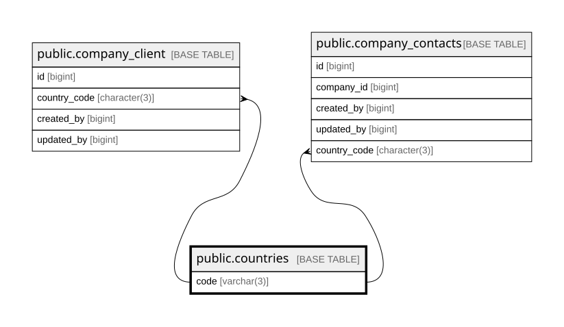

# public.countries

## Columns

| Name      | Type         | Default | Nullable | Children                                                                                                | Parents | Comment |
| --------- | ------------ | ------- | -------- | ------------------------------------------------------------------------------------------------------- | ------- | ------- |
| code      | varchar(3)   |         | false    | [public.company_client](public.company_client.md) [public.company_contacts](public.company_contacts.md) |         |         |
| name      | varchar(100) |         | false    |                                                                                                         |         |         |
| dial_code | varchar(10)  |         | false    |                                                                                                         |         |         |

## Constraints

| Name                         | Type        | Definition         |
| ---------------------------- | ----------- | ------------------ |
| countries_code_not_null      | n           | NOT NULL code      |
| countries_dial_code_not_null | n           | NOT NULL dial_code |
| countries_name_not_null      | n           | NOT NULL name      |
| countries_pkey               | PRIMARY KEY | PRIMARY KEY (code) |

## Indexes

| Name                    | Definition                                                                             |
| ----------------------- | -------------------------------------------------------------------------------------- |
| countries_pkey          | CREATE UNIQUE INDEX countries_pkey ON public.countries USING btree (code)              |
| idx_countries_name_trgm | CREATE INDEX idx_countries_name_trgm ON public.countries USING gin (name gin_trgm_ops) |

## Relations

---

> Generated by [tbls](https://github.com/k1LoW/tbls)
