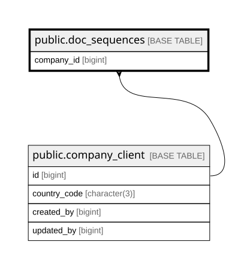

# public.doc_sequences

## Description

Running sequence per (doc_type, company, year). UPSERT atomic via fn_next_doc_no for race-safe number generation.

## Columns

| Name       | Type                     | Default | Nullable | Children | Parents                                           | Comment |
| ---------- | ------------------------ | ------- | -------- | -------- | ------------------------------------------------- | ------- |
| doc_type   | varchar(10)              |         | false    |          |                                                   |         |
| company_id | bigint                   |         | false    |          | [public.company_client](public.company_client.md) |         |
| year       | integer                  |         | false    |          |                                                   |         |
| last_seq   | integer                  | 0       | false    |          |                                                   |         |
| updated_at | timestamp with time zone | now()   | false    |          |                                                   |         |

## Constraints

| Name                              | Type        | Definition                                                                                                                                             |
| --------------------------------- | ----------- | ------------------------------------------------------------------------------------------------------------------------------------------------------ |
| doc_sequences_company_id_not_null | n           | NOT NULL company_id                                                                                                                                    |
| doc_sequences_doc_type_check      | CHECK       | CHECK (((doc_type)::text = ANY ((ARRAY['Q'::character varying, 'PO'::character varying, 'INV'::character varying, 'DN'::character varying])::text[]))) |
| doc_sequences_doc_type_not_null   | n           | NOT NULL doc_type                                                                                                                                      |
| doc_sequences_last_seq_not_null   | n           | NOT NULL last_seq                                                                                                                                      |
| doc_sequences_updated_at_not_null | n           | NOT NULL updated_at                                                                                                                                    |
| doc_sequences_year_not_null       | n           | NOT NULL year                                                                                                                                          |
| doc_sequences_company_id_fkey     | FOREIGN KEY | FOREIGN KEY (company_id) REFERENCES company_client(id) ON DELETE RESTRICT                                                                              |
| doc_sequences_pkey                | PRIMARY KEY | PRIMARY KEY (doc_type, company_id, year)                                                                                                               |

## Indexes

| Name               | Definition                                                                                              |
| ------------------ | ------------------------------------------------------------------------------------------------------- |
| doc_sequences_pkey | CREATE UNIQUE INDEX doc_sequences_pkey ON public.doc_sequences USING btree (doc_type, company_id, year) |

## Relations

---

> Generated by [tbls](https://github.com/k1LoW/tbls)
