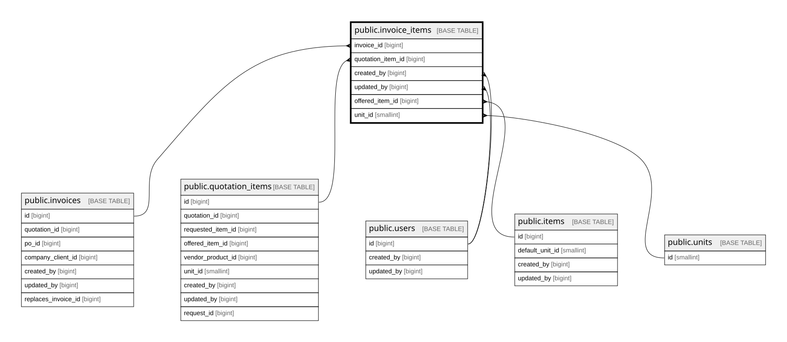

# public.invoice_items

## Columns

| Name              | Type                     | Default                                   | Nullable | Children | Parents                                             | Comment                                                                  |
| ----------------- | ------------------------ | ----------------------------------------- | -------- | -------- | --------------------------------------------------- | ------------------------------------------------------------------------ |
| id                | bigint                   | nextval('invoice_items_id_seq'::regclass) | false    |          |                                                     |                                                                          |
| invoice_id        | bigint                   |                                           | false    |          | [public.invoices](public.invoices.md)               |                                                                          |
| quotation_item_id | bigint                   |                                           | true     |          | [public.quotation_items](public.quotation_items.md) |                                                                          |
| line_type         | varchar(20)              |                                           | false    |          |                                                     |                                                                          |
| item_name         | text                     |                                           | false    |          |                                                     | Snapshot of items.name at invoice creation; not FK for legal compliance. |
| item_code         | varchar(20)              |                                           | true     |          |                                                     |                                                                          |
| goods_or_service  | character(1)             |                                           | true     |          |                                                     |                                                                          |
| unit_code         | varchar(10)              |                                           | true     |          |                                                     |                                                                          |
| qty               | numeric(12,2)            |                                           | false    |          |                                                     |                                                                          |
| unit_price        | numeric(15,2)            |                                           | false    |          |                                                     |                                                                          |
| dpp               | numeric(15,2)            |                                           | true     |          |                                                     |                                                                          |
| dpp_nilai_lain    | numeric(15,2)            |                                           | true     |          |                                                     |                                                                          |
| ppn_rate          | numeric(4,2)             |                                           | true     |          |                                                     |                                                                          |
| ppn_amount        | numeric(15,2)            |                                           | true     |          |                                                     |                                                                          |
| created_by        | bigint                   |                                           | false    |          | [public.users](public.users.md)                     |                                                                          |
| updated_by        | bigint                   |                                           | true     |          | [public.users](public.users.md)                     |                                                                          |
| created_at        | timestamp with time zone | now()                                     | false    |          |                                                     |                                                                          |
| line_number       | smallint                 |                                           | true     |          |                                                     |                                                                          |
| offered_item_id   | bigint                   |                                           | true     |          | [public.items](public.items.md)                     |                                                                          |
| cost_price        | numeric(15,2)            |                                           | true     |          |                                                     |                                                                          |
| unit_id           | smallint                 |                                           | true     |          | [public.units](public.units.md)                     |                                                                          |
| ship_destination  | varchar(255)             |                                           | true     |          |                                                     |                                                                          |

## Constraints

| Name                                 | Type        | Definition                                                                                                       |
| ------------------------------------ | ----------- | ---------------------------------------------------------------------------------------------------------------- |
| invoice_items_created_at_not_null    | n           | NOT NULL created_at                                                                                              |
| invoice_items_created_by_not_null    | n           | NOT NULL created_by                                                                                              |
| invoice_items_id_not_null            | n           | NOT NULL id                                                                                                      |
| invoice_items_invoice_id_not_null    | n           | NOT NULL invoice_id                                                                                              |
| invoice_items_item_name_not_null     | n           | NOT NULL item_name                                                                                               |
| invoice_items_line_type_check        | CHECK       | CHECK (((line_type)::text = ANY ((ARRAY['product'::character varying, 'shipping'::character varying])::text[]))) |
| invoice_items_line_type_not_null     | n           | NOT NULL line_type                                                                                               |
| invoice_items_qty_check              | CHECK       | CHECK ((qty >= (0)::numeric))                                                                                    |
| invoice_items_qty_not_null           | n           | NOT NULL qty                                                                                                     |
| invoice_items_unit_price_check       | CHECK       | CHECK ((unit_price >= (0)::numeric))                                                                             |
| invoice_items_unit_price_not_null    | n           | NOT NULL unit_price                                                                                              |
| invoice_items_created_by_fkey        | FOREIGN KEY | FOREIGN KEY (created_by) REFERENCES users(id) ON DELETE RESTRICT                                                 |
| invoice_items_updated_by_fkey        | FOREIGN KEY | FOREIGN KEY (updated_by) REFERENCES users(id) ON DELETE RESTRICT                                                 |
| invoice_items_unit_id_fkey           | FOREIGN KEY | FOREIGN KEY (unit_id) REFERENCES units(id) ON DELETE RESTRICT                                                    |
| invoice_items_offered_item_id_fkey   | FOREIGN KEY | FOREIGN KEY (offered_item_id) REFERENCES items(id) ON DELETE RESTRICT                                            |
| invoice_items_quotation_item_id_fkey | FOREIGN KEY | FOREIGN KEY (quotation_item_id) REFERENCES quotation_items(id) ON DELETE SET NULL                                |
| invoice_items_invoice_id_fkey        | FOREIGN KEY | FOREIGN KEY (invoice_id) REFERENCES invoices(id) ON DELETE CASCADE                                               |
| invoice_items_pkey                   | PRIMARY KEY | PRIMARY KEY (id)                                                                                                 |

## Indexes

| Name                             | Definition                                                                                            |
| -------------------------------- | ----------------------------------------------------------------------------------------------------- |
| invoice_items_pkey               | CREATE UNIQUE INDEX invoice_items_pkey ON public.invoice_items USING btree (id)                       |
| idx_invoice_items_invoice        | CREATE INDEX idx_invoice_items_invoice ON public.invoice_items USING btree (invoice_id)               |
| idx_invoice_items_quotation_item | CREATE INDEX idx_invoice_items_quotation_item ON public.invoice_items USING btree (quotation_item_id) |
| idx_invoice_items_offered_item   | CREATE INDEX idx_invoice_items_offered_item ON public.invoice_items USING btree (offered_item_id)     |
| idx_invoice_items_unit           | CREATE INDEX idx_invoice_items_unit ON public.invoice_items USING btree (unit_id)                     |

## Relations

---

> Generated by [tbls](https://github.com/k1LoW/tbls)
