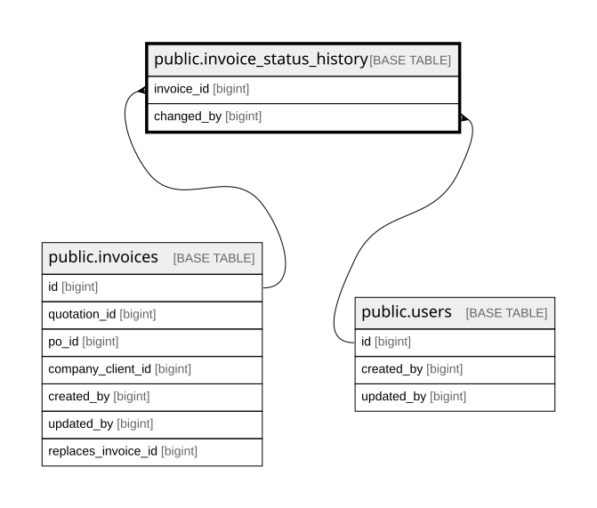

# public.invoice_status_history

## Columns

| Name              | Type                     | Default                                            | Nullable | Children | Parents                               | Comment |
| ----------------- | ------------------------ | -------------------------------------------------- | -------- | -------- | ------------------------------------- | ------- |
| id                | bigint                   | nextval('invoice_status_history_id_seq'::regclass) | false    |          |                                       |         |
| invoice_id        | bigint                   |                                                    | false    |          | [public.invoices](public.invoices.md) |         |
| from_status       | varchar(20)              |                                                    | false    |          |                                       |         |
| to_status         | varchar(20)              |                                                    | false    |          |                                       |         |
| note              | text                     |                                                    | true     |          |                                       |         |
| payment_proof_key | text                     |                                                    | true     |          |                                       |         |
| changed_by        | bigint                   |                                                    | false    |          | [public.users](public.users.md)       |         |
| changed_at        | timestamp with time zone | now()                                              | false    |          |                                       |         |

## Constraints

| Name                                        | Type        | Definition                                                         |
| ------------------------------------------- | ----------- | ------------------------------------------------------------------ |
| invoice_status_history_changed_at_not_null  | n           | NOT NULL changed_at                                                |
| invoice_status_history_changed_by_not_null  | n           | NOT NULL changed_by                                                |
| invoice_status_history_from_status_not_null | n           | NOT NULL from_status                                               |
| invoice_status_history_id_not_null          | n           | NOT NULL id                                                        |
| invoice_status_history_invoice_id_not_null  | n           | NOT NULL invoice_id                                                |
| invoice_status_history_to_status_not_null   | n           | NOT NULL to_status                                                 |
| invoice_status_history_changed_by_fkey      | FOREIGN KEY | FOREIGN KEY (changed_by) REFERENCES users(id) ON DELETE RESTRICT   |
| invoice_status_history_invoice_id_fkey      | FOREIGN KEY | FOREIGN KEY (invoice_id) REFERENCES invoices(id) ON DELETE CASCADE |
| invoice_status_history_pkey                 | PRIMARY KEY | PRIMARY KEY (id)                                                   |

## Indexes

| Name                               | Definition                                                                                                            |
| ---------------------------------- | --------------------------------------------------------------------------------------------------------------------- |
| invoice_status_history_pkey        | CREATE UNIQUE INDEX invoice_status_history_pkey ON public.invoice_status_history USING btree (id)                     |
| idx_invoice_status_history_invoice | CREATE INDEX idx_invoice_status_history_invoice ON public.invoice_status_history USING btree (invoice_id, changed_at) |

## Relations

---

> Generated by [tbls](https://github.com/k1LoW/tbls)
