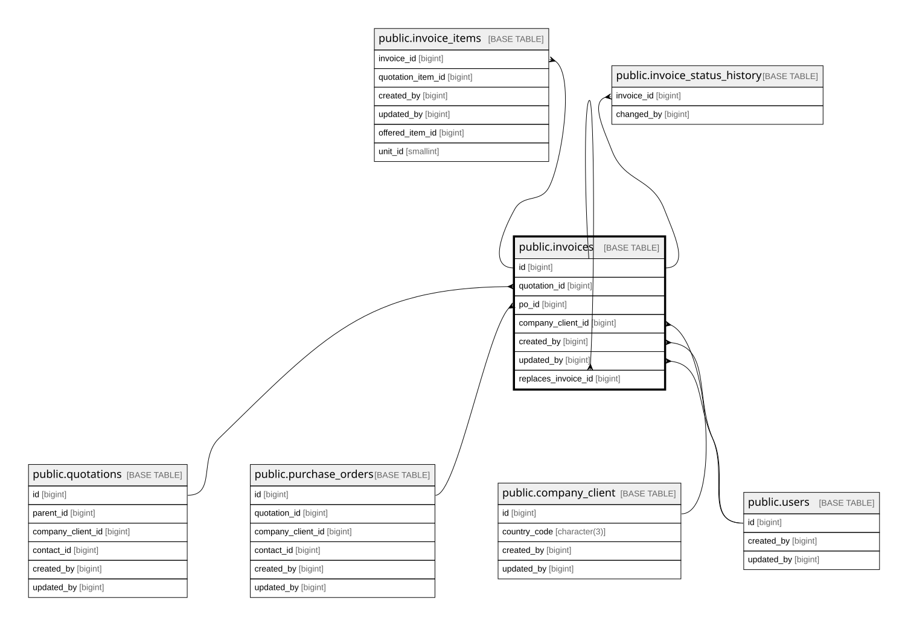

# public.invoices

## Columns

| Name                  | Type                     | Default                              | Nullable | Extra Definition                                          | Children                                        | Parents                                             | Comment                                                                                          |
| --------------------- | ------------------------ | ------------------------------------ | -------- | --------------------------------------------------------- | ----------------------------------------------- | --------------------------------------------------- | ------------------------------------------------------------------------------------------------ |
| id                    | bigint                   | nextval('invoices_id_seq'::regclass) | false    |                                                           | [public.invoice_items](public.invoice_items.md) |                                                     |                                                                                                  |
| invoice_no            | varchar(50)              |                                      | false    |                                                           |                                                 |                                                     |                                                                                                  |
| quotation_id          | bigint                   |                                      | false    |                                                           |                                                 | [public.quotations](public.quotations.md)           |                                                                                                  |
| po_id                 | bigint                   |                                      | true     |                                                           |                                                 | [public.purchase_orders](public.purchase_orders.md) |                                                                                                  |
| company_client_id     | bigint                   |                                      | false    |                                                           |                                                 | [public.company_client](public.company_client.md)   |                                                                                                  |
| invoice_date          | date                     |                                      | false    |                                                           |                                                 |                                                     |                                                                                                  |
| due_date              | date                     |                                      | true     |                                                           |                                                 |                                                     |                                                                                                  |
| subtotal              | numeric(15,2)            |                                      | true     |                                                           |                                                 |                                                     |                                                                                                  |
| dpp                   | numeric(15,2)            |                                      | true     |                                                           |                                                 |                                                     |                                                                                                  |
| dpp_nilai_lain        | numeric(15,2)            |                                      | true     | GENERATED ALWAYS AS ((dpp * 11.0) / 12.0) STORED          |                                                 |                                                     |                                                                                                  |
| ppn_rate              | numeric(4,2)             | 12.00                                | false    |                                                           |                                                 |                                                     |                                                                                                  |
| ppn_amount            | numeric(15,2)            |                                      | true     | GENERATED ALWAYS AS (((dpp * 11.0) / 12.0) * 0.12) STORED |                                                 |                                                     |                                                                                                  |
| tax_transaction_code  | varchar(2)               | '04'::character varying              | true     |                                                           |                                                 |                                                     |                                                                                                  |
| faktur_type           | varchar(10)              | 'Normal'::character varying          | true     |                                                           |                                                 |                                                     |                                                                                                  |
| status                | varchar(20)              | 'draft'::character varying           | false    |                                                           |                                                 |                                                     |                                                                                                  |
| row_version           | integer                  | 0                                    | false    |                                                           |                                                 |                                                     |                                                                                                  |
| created_by            | bigint                   |                                      | false    |                                                           |                                                 | [public.users](public.users.md)                     |                                                                                                  |
| updated_by            | bigint                   |                                      | true     |                                                           |                                                 | [public.users](public.users.md)                     |                                                                                                  |
| created_at            | timestamp with time zone | now()                                | false    |                                                           |                                                 |                                                     |                                                                                                  |
| updated_at            | timestamp with time zone | now()                                | false    |                                                           |                                                 |                                                     |                                                                                                  |
| total                 | numeric(15,2)            |                                      | true     | GENERATED ALWAYS AS (dpp * 1.11) STORED                   |                                                 |                                                     |                                                                                                  |
| attachment_object_key | text                     |                                      | true     |                                                           |                                                 |                                                     | MinIO object key inside bucket invoice-attachments (e.g. payment receipt). NULL = no attachment. |

## Constraints

| Name                                | Type        | Definition                                                                                                                                                                                       |
| ----------------------------------- | ----------- | ------------------------------------------------------------------------------------------------------------------------------------------------------------------------------------------------ |
| invoices_company_client_id_not_null | n           | NOT NULL company_client_id                                                                                                                                                                       |
| invoices_created_at_not_null        | n           | NOT NULL created_at                                                                                                                                                                              |
| invoices_created_by_not_null        | n           | NOT NULL created_by                                                                                                                                                                              |
| invoices_faktur_type_check          | CHECK       | CHECK (((faktur_type)::text = ANY ((ARRAY['Normal'::character varying, 'Pengganti'::character varying, 'Pembatalan'::character varying])::text[])))                                              |
| invoices_id_not_null                | n           | NOT NULL id                                                                                                                                                                                      |
| invoices_invoice_date_not_null      | n           | NOT NULL invoice_date                                                                                                                                                                            |
| invoices_invoice_no_not_null        | n           | NOT NULL invoice_no                                                                                                                                                                              |
| invoices_ppn_rate_check             | CHECK       | CHECK ((ppn_rate = 12.00))                                                                                                                                                                       |
| invoices_ppn_rate_not_null          | n           | NOT NULL ppn_rate                                                                                                                                                                                |
| invoices_quotation_id_not_null      | n           | NOT NULL quotation_id                                                                                                                                                                            |
| invoices_row_version_not_null       | n           | NOT NULL row_version                                                                                                                                                                             |
| invoices_status_check               | CHECK       | CHECK (((status)::text = ANY ((ARRAY['draft'::character varying, 'sent'::character varying, 'paid'::character varying, 'overdue'::character varying, 'cancelled'::character varying])::text[]))) |
| invoices_status_not_null            | n           | NOT NULL status                                                                                                                                                                                  |
| invoices_tax_transaction_code_check | CHECK       | CHECK (((tax_transaction_code)::text = ANY ((ARRAY['01'::character varying, '04'::character varying, '07'::character varying, '08'::character varying, '09'::character varying])::text[])))      |
| invoices_updated_at_not_null        | n           | NOT NULL updated_at                                                                                                                                                                              |
| invoices_created_by_fkey            | FOREIGN KEY | FOREIGN KEY (created_by) REFERENCES users(id) ON DELETE RESTRICT                                                                                                                                 |
| invoices_updated_by_fkey            | FOREIGN KEY | FOREIGN KEY (updated_by) REFERENCES users(id) ON DELETE RESTRICT                                                                                                                                 |
| invoices_company_client_id_fkey     | FOREIGN KEY | FOREIGN KEY (company_client_id) REFERENCES company_client(id) ON DELETE RESTRICT                                                                                                                 |
| invoices_quotation_id_fkey          | FOREIGN KEY | FOREIGN KEY (quotation_id) REFERENCES quotations(id) ON DELETE RESTRICT                                                                                                                          |
| invoices_po_id_fkey                 | FOREIGN KEY | FOREIGN KEY (po_id) REFERENCES purchase_orders(id) ON DELETE RESTRICT                                                                                                                            |
| invoices_pkey                       | PRIMARY KEY | PRIMARY KEY (id)                                                                                                                                                                                 |
| invoices_invoice_no_key             | UNIQUE      | UNIQUE (invoice_no)                                                                                                                                                                              |

## Indexes

| Name                     | Definition                                                                                       |
| ------------------------ | ------------------------------------------------------------------------------------------------ |
| invoices_pkey            | CREATE UNIQUE INDEX invoices_pkey ON public.invoices USING btree (id)                            |
| invoices_invoice_no_key  | CREATE UNIQUE INDEX invoices_invoice_no_key ON public.invoices USING btree (invoice_no)          |
| idx_invoices_quotation   | CREATE INDEX idx_invoices_quotation ON public.invoices USING btree (quotation_id)                |
| idx_invoices_po          | CREATE INDEX idx_invoices_po ON public.invoices USING btree (po_id)                              |
| idx_invoices_company     | CREATE INDEX idx_invoices_company ON public.invoices USING btree (company_client_id)             |
| idx_invoices_status_date | CREATE INDEX idx_invoices_status_date ON public.invoices USING btree (status, invoice_date DESC) |

## Triggers

| Name                    | Definition                                                                                                             |
| ----------------------- | ---------------------------------------------------------------------------------------------------------------------- |
| trg_invoices_updated_at | CREATE TRIGGER trg_invoices_updated_at BEFORE UPDATE ON public.invoices FOR EACH ROW EXECUTE FUNCTION set_updated_at() |

## Relations

---

> Generated by [tbls](https://github.com/k1LoW/tbls)
