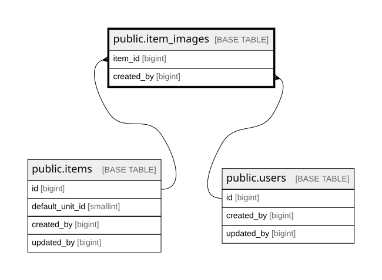

# public.item_images

## Columns

| Name       | Type                     | Default                                 | Nullable | Children | Parents                         | Comment |
| ---------- | ------------------------ | --------------------------------------- | -------- | -------- | ------------------------------- | ------- |
| id         | bigint                   | nextval('item_images_id_seq'::regclass) | false    |          |                                 |         |
| item_id    | bigint                   |                                         | false    |          | [public.items](public.items.md) |         |
| object_key | text                     |                                         | false    |          |                                 |         |
| created_by | bigint                   |                                         | true     |          | [public.users](public.users.md) |         |
| created_at | timestamp with time zone | now()                                   | false    |          |                                 |         |

## Constraints

| Name                            | Type        | Definition                                                   |
| ------------------------------- | ----------- | ------------------------------------------------------------ |
| item_images_created_at_not_null | n           | NOT NULL created_at                                          |
| item_images_id_not_null         | n           | NOT NULL id                                                  |
| item_images_item_id_not_null    | n           | NOT NULL item_id                                             |
| item_images_object_key_not_null | n           | NOT NULL object_key                                          |
| item_images_created_by_fkey     | FOREIGN KEY | FOREIGN KEY (created_by) REFERENCES users(id)                |
| item_images_item_id_fkey        | FOREIGN KEY | FOREIGN KEY (item_id) REFERENCES items(id) ON DELETE CASCADE |
| item_images_pkey                | PRIMARY KEY | PRIMARY KEY (id)                                             |
| item_images_object_key_key      | UNIQUE      | UNIQUE (object_key)                                          |

## Indexes

| Name                       | Definition                                                                                    |
| -------------------------- | --------------------------------------------------------------------------------------------- |
| item_images_pkey           | CREATE UNIQUE INDEX item_images_pkey ON public.item_images USING btree (id)                   |
| item_images_object_key_key | CREATE UNIQUE INDEX item_images_object_key_key ON public.item_images USING btree (object_key) |
| idx_item_images_item       | CREATE INDEX idx_item_images_item ON public.item_images USING btree (item_id, id)             |

## Relations

---

> Generated by [tbls](https://github.com/k1LoW/tbls)
