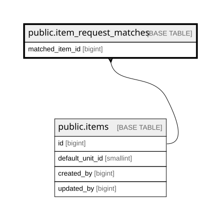

# public.item_request_matches

## Columns

| Name            | Type                     | Default                                          | Nullable | Children | Parents                         | Comment |
| --------------- | ------------------------ | ------------------------------------------------ | -------- | -------- | ------------------------------- | ------- |
| id              | bigint                   | nextval('item_request_matches_id_seq'::regclass) | false    |          |                                 |         |
| request_text    | text                     |                                                  | false    |          |                                 |         |
| matched_item_id | bigint                   |                                                  | true     |          | [public.items](public.items.md) |         |
| match_count     | integer                  | 1                                                | false    |          |                                 |         |
| last_used_at    | timestamp with time zone | now()                                            | true     |          |                                 |         |

## Constraints

| Name                                       | Type        | Definition                                                            |
| ------------------------------------------ | ----------- | --------------------------------------------------------------------- |
| item_request_matches_id_not_null           | n           | NOT NULL id                                                           |
| item_request_matches_match_count_not_null  | n           | NOT NULL match_count                                                  |
| item_request_matches_request_text_not_null | n           | NOT NULL request_text                                                 |
| item_request_matches_matched_item_id_fkey  | FOREIGN KEY | FOREIGN KEY (matched_item_id) REFERENCES items(id) ON DELETE RESTRICT |
| item_request_matches_pkey                  | PRIMARY KEY | PRIMARY KEY (id)                                                      |

## Indexes

| Name                            | Definition                                                                                                                           |
| ------------------------------- | ------------------------------------------------------------------------------------------------------------------------------------ |
| item_request_matches_pkey       | CREATE UNIQUE INDEX item_request_matches_pkey ON public.item_request_matches USING btree (id)                                        |
| idx_item_request_matches_trgm   | CREATE INDEX idx_item_request_matches_trgm ON public.item_request_matches USING gin (request_text gin_trgm_ops)                      |
| idx_item_request_matches_unique | CREATE UNIQUE INDEX idx_item_request_matches_unique ON public.item_request_matches USING btree (lower(TRIM(BOTH FROM request_text))) |

## Relations

---

> Generated by [tbls](https://github.com/k1LoW/tbls)
