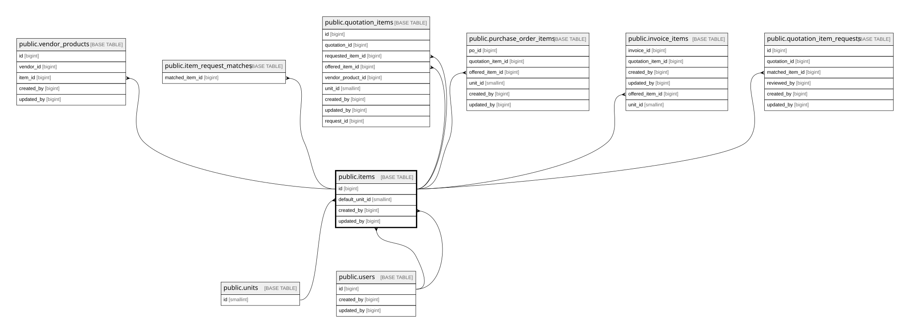

# public.items

## Columns

| Name             | Type                     | Default                           | Nullable | Children                                                                                                                                                                                                                                                                                                                                                | Parents                         | Comment                                                               |
| ---------------- | ------------------------ | --------------------------------- | -------- | ------------------------------------------------------------------------------------------------------------------------------------------------------------------------------------------------------------------------------------------------------------------------------------------------------------------------------------------------------- | ------------------------------- | --------------------------------------------------------------------- |
| id               | bigint                   | nextval('items_id_seq'::regclass) | false    | [public.vendor_products](public.vendor_products.md) [public.item_request_matches](public.item_request_matches.md) [public.quotation_items](public.quotation_items.md) [public.purchase_order_items](public.purchase_order_items.md) [public.invoice_items](public.invoice_items.md) [public.quotation_item_requests](public.quotation_item_requests.md) |                                 |                                                                       |
| name             | varchar(500)             |                                   | false    |                                                                                                                                                                                                                                                                                                                                                         |                                 |                                                                       |
| impa_code        | varchar(20)              |                                   | true     |                                                                                                                                                                                                                                                                                                                                                         |                                 |                                                                       |
| default_unit_id  | smallint                 |                                   | true     |                                                                                                                                                                                                                                                                                                                                                         | [public.units](public.units.md) |                                                                       |
| is_active        | boolean                  | true                              | false    |                                                                                                                                                                                                                                                                                                                                                         |                                 |                                                                       |
| created_by       | bigint                   |                                   | false    |                                                                                                                                                                                                                                                                                                                                                         | [public.users](public.users.md) |                                                                       |
| updated_by       | bigint                   |                                   | true     |                                                                                                                                                                                                                                                                                                                                                         | [public.users](public.users.md) |                                                                       |
| created_at       | timestamp with time zone | now()                             | false    |                                                                                                                                                                                                                                                                                                                                                         |                                 |                                                                       |
| updated_at       | timestamp with time zone | now()                             | false    |                                                                                                                                                                                                                                                                                                                                                         |                                 |                                                                       |
| description      | text                     |                                   | true     |                                                                                                                                                                                                                                                                                                                                                         |                                 |                                                                       |
| image_object_key | text                     |                                   | true     |                                                                                                                                                                                                                                                                                                                                                         |                                 | MinIO object key inside bucket item-images. NULL = no image uploaded. |

## Constraints

| Name                       | Type        | Definition                                                            |
| -------------------------- | ----------- | --------------------------------------------------------------------- |
| items_created_at_not_null  | n           | NOT NULL created_at                                                   |
| items_created_by_not_null  | n           | NOT NULL created_by                                                   |
| items_id_not_null          | n           | NOT NULL id                                                           |
| items_is_active_not_null   | n           | NOT NULL is_active                                                    |
| items_name_not_null        | n           | NOT NULL name                                                         |
| items_updated_at_not_null  | n           | NOT NULL updated_at                                                   |
| items_created_by_fkey      | FOREIGN KEY | FOREIGN KEY (created_by) REFERENCES users(id) ON DELETE RESTRICT      |
| items_updated_by_fkey      | FOREIGN KEY | FOREIGN KEY (updated_by) REFERENCES users(id) ON DELETE RESTRICT      |
| items_default_unit_id_fkey | FOREIGN KEY | FOREIGN KEY (default_unit_id) REFERENCES units(id) ON DELETE RESTRICT |
| items_pkey                 | PRIMARY KEY | PRIMARY KEY (id)                                                      |

## Indexes

| Name                | Definition                                                                                        |
| ------------------- | ------------------------------------------------------------------------------------------------- |
| items_pkey          | CREATE UNIQUE INDEX items_pkey ON public.items USING btree (id)                                   |
| idx_items_name_trgm | CREATE INDEX idx_items_name_trgm ON public.items USING gin (name gin_trgm_ops)                    |
| idx_items_impa      | CREATE INDEX idx_items_impa ON public.items USING btree (impa_code) WHERE (impa_code IS NOT NULL) |

## Triggers

| Name                 | Definition                                                                                                                  |
| -------------------- | --------------------------------------------------------------------------------------------------------------------------- |
| trg_items_updated_at | CREATE TRIGGER trg_items_updated_at BEFORE UPDATE ON public.items FOR EACH ROW EXECUTE FUNCTION set_updated_at_no_version() |

## Relations

---

> Generated by [tbls](https://github.com/k1LoW/tbls)
