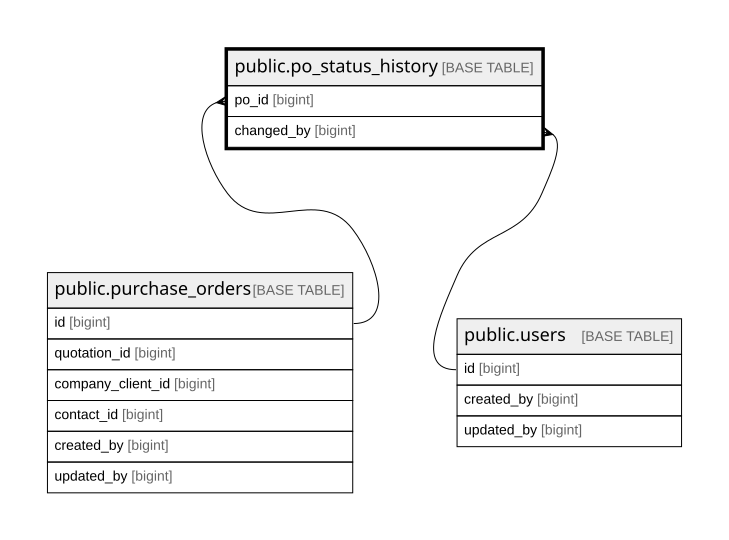

# public.po_status_history

## Description

PO status timeline. from_status NULL marks creation. Written by trg_log_po_creation, fn_change_po_status, fn_attach_po_file and fn_detach_po_file.

## Columns

| Name        | Type                     | Default                                       | Nullable | Children | Parents                                             | Comment |
| ----------- | ------------------------ | --------------------------------------------- | -------- | -------- | --------------------------------------------------- | ------- |
| id          | bigint                   | nextval('po_status_history_id_seq'::regclass) | false    |          |                                                     |         |
| po_id       | bigint                   |                                               | false    |          | [public.purchase_orders](public.purchase_orders.md) |         |
| from_status | varchar(20)              |                                               | true     |          |                                                     |         |
| to_status   | varchar(20)              |                                               | false    |          |                                                     |         |
| note        | text                     |                                               | true     |          |                                                     |         |
| changed_by  | bigint                   |                                               | false    |          | [public.users](public.users.md)                     |         |
| changed_at  | timestamp with time zone | now()                                         | false    |          |                                                     |         |

## Constraints

| Name                                  | Type        | Definition                                                           |
| ------------------------------------- | ----------- | -------------------------------------------------------------------- |
| po_status_history_changed_at_not_null | n           | NOT NULL changed_at                                                  |
| po_status_history_changed_by_not_null | n           | NOT NULL changed_by                                                  |
| po_status_history_id_not_null         | n           | NOT NULL id                                                          |
| po_status_history_po_id_not_null      | n           | NOT NULL po_id                                                       |
| po_status_history_to_status_not_null  | n           | NOT NULL to_status                                                   |
| po_status_history_changed_by_fkey     | FOREIGN KEY | FOREIGN KEY (changed_by) REFERENCES users(id) ON DELETE RESTRICT     |
| po_status_history_po_id_fkey          | FOREIGN KEY | FOREIGN KEY (po_id) REFERENCES purchase_orders(id) ON DELETE CASCADE |
| po_status_history_pkey                | PRIMARY KEY | PRIMARY KEY (id)                                                     |

## Indexes

| Name                     | Definition                                                                                            |
| ------------------------ | ----------------------------------------------------------------------------------------------------- |
| po_status_history_pkey   | CREATE UNIQUE INDEX po_status_history_pkey ON public.po_status_history USING btree (id)               |
| idx_po_status_history_po | CREATE INDEX idx_po_status_history_po ON public.po_status_history USING btree (po_id, changed_at, id) |

## Relations

---

> Generated by [tbls](https://github.com/k1LoW/tbls)
