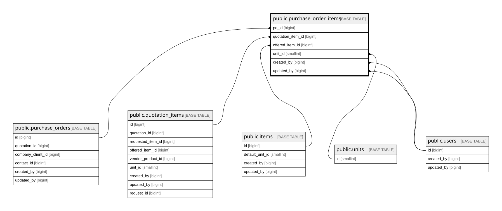

# public.purchase_order_items

## Columns

| Name              | Type                     | Default                                          | Nullable | Extra Definition                                                                                                                                                                                                       | Children | Parents                                             | Comment                                                                                        |
| ----------------- | ------------------------ | ------------------------------------------------ | -------- | ---------------------------------------------------------------------------------------------------------------------------------------------------------------------------------------------------------------------- | -------- | --------------------------------------------------- | ---------------------------------------------------------------------------------------------- |
| id                | bigint                   | nextval('purchase_order_items_id_seq'::regclass) | false    |                                                                                                                                                                                                                        |          |                                                     |                                                                                                |
| po_id             | bigint                   |                                                  | false    |                                                                                                                                                                                                                        |          | [public.purchase_orders](public.purchase_orders.md) |                                                                                                |
| quotation_item_id | bigint                   |                                                  | true     |                                                                                                                                                                                                                        |          | [public.quotation_items](public.quotation_items.md) |                                                                                                |
| line_number       | smallint                 |                                                  | false    |                                                                                                                                                                                                                        |          |                                                     |                                                                                                |
| item_type         | varchar(20)              |                                                  | false    |                                                                                                                                                                                                                        |          |                                                     |                                                                                                |
| offered_item_id   | bigint                   |                                                  | true     |                                                                                                                                                                                                                        |          | [public.items](public.items.md)                     |                                                                                                |
| qty               | numeric(12,2)            |                                                  | false    |                                                                                                                                                                                                                        |          |                                                     |                                                                                                |
| unit_id           | smallint                 |                                                  | true     |                                                                                                                                                                                                                        |          | [public.units](public.units.md)                     |                                                                                                |
| selling_price     | numeric(15,2)            |                                                  | false    |                                                                                                                                                                                                                        |          |                                                     |                                                                                                |
| cost_price        | numeric(15,2)            |                                                  | true     |                                                                                                                                                                                                                        |          |                                                     |                                                                                                |
| total_selling     | numeric(15,2)            |                                                  | true     | GENERATED ALWAYS AS (qty * selling_price) STORED                                                                                                                                                                       |          |                                                     |                                                                                                |
| total_cost        | numeric(15,2)            |                                                  | true     | GENERATED ALWAYS AS (qty * cost_price) STORED                                                                                                                                                                          |          |                                                     |                                                                                                |
| profit_amount     | numeric(15,2)            |                                                  | true     | GENERATED ALWAYS AS (qty * (selling_price - cost_price)) STORED                                                                                                                                                        |          |                                                     |                                                                                                |
| profit_pct        | numeric(7,4)             |                                                  | true     | GENERATED ALWAYS AS ((selling_price - cost_price) / NULLIF(cost_price, (0)::numeric)) STORED                                                                                                                           |          |                                                     |                                                                                                |
| is_available      | boolean                  | true                                             | false    |                                                                                                                                                                                                                        |          |                                                     |                                                                                                |
| created_by        | bigint                   |                                                  | false    |                                                                                                                                                                                                                        |          | [public.users](public.users.md)                     |                                                                                                |
| updated_by        | bigint                   |                                                  | true     |                                                                                                                                                                                                                        |          | [public.users](public.users.md)                     |                                                                                                |
| created_at        | timestamp with time zone | now()                                            | false    |                                                                                                                                                                                                                        |          |                                                     |                                                                                                |
| updated_at        | timestamp with time zone | now()                                            | false    |                                                                                                                                                                                                                        |          |                                                     |                                                                                                |
| discount_pct      | numeric(5,2)             |                                                  | false    |                                                                                                                                                                                                                        |          |                                                     | Snapshot of purchase_orders.discount_pct (0..100), auto-inherited via trg_inherit_po_discount. |
| discount_amount   | numeric(15,2)            |                                                  | true     | GENERATED ALWAYS AS  CASE     WHEN ((item_type)::text = 'product'::text) THEN ((qty * selling_price) * (discount_pct / (100)::numeric))     ELSE (0)::numeric END STORED                           |          |                                                     |                                                                                                |
| subtotal          | numeric(15,2)            |                                                  | true     | GENERATED ALWAYS AS  CASE     WHEN ((item_type)::text = 'product'::text) THEN ((qty * selling_price) * ((1)::numeric - (discount_pct / (100)::numeric)))     ELSE (qty * selling_price) END STORED |          |                                                     |                                                                                                |
| item_name         | text                     |                                                  | true     |                                                                                                                                                                                                                        |          |                                                     |                                                                                                |
| item_code         | varchar(20)              |                                                  | true     |                                                                                                                                                                                                                        |          |                                                     |                                                                                                |
| ship_destination  | varchar(255)             |                                                  | true     |                                                                                                                                                                                                                        |          |                                                     |                                                                                                |

## Constraints

| Name                                        | Type        | Definition                                                                                                       |
| ------------------------------------------- | ----------- | ---------------------------------------------------------------------------------------------------------------- |
| purchase_order_items_created_at_not_null    | n           | NOT NULL created_at                                                                                              |
| purchase_order_items_created_by_not_null    | n           | NOT NULL created_by                                                                                              |
| purchase_order_items_discount_pct_check     | CHECK       | CHECK (((discount_pct >= (0)::numeric) AND (discount_pct <= (100)::numeric)))                                    |
| purchase_order_items_discount_pct_not_null  | n           | NOT NULL discount_pct                                                                                            |
| purchase_order_items_id_not_null            | n           | NOT NULL id                                                                                                      |
| purchase_order_items_is_available_not_null  | n           | NOT NULL is_available                                                                                            |
| purchase_order_items_item_type_check        | CHECK       | CHECK (((item_type)::text = ANY ((ARRAY['product'::character varying, 'shipping'::character varying])::text[]))) |
| purchase_order_items_item_type_not_null     | n           | NOT NULL item_type                                                                                               |
| purchase_order_items_line_number_not_null   | n           | NOT NULL line_number                                                                                             |
| purchase_order_items_po_id_not_null         | n           | NOT NULL po_id                                                                                                   |
| purchase_order_items_qty_check              | CHECK       | CHECK ((qty >= (0)::numeric))                                                                                    |
| purchase_order_items_qty_not_null           | n           | NOT NULL qty                                                                                                     |
| purchase_order_items_selling_price_check    | CHECK       | CHECK ((selling_price >= (0)::numeric))                                                                          |
| purchase_order_items_selling_price_not_null | n           | NOT NULL selling_price                                                                                           |
| purchase_order_items_updated_at_not_null    | n           | NOT NULL updated_at                                                                                              |
| purchase_order_items_created_by_fkey        | FOREIGN KEY | FOREIGN KEY (created_by) REFERENCES users(id) ON DELETE RESTRICT                                                 |
| purchase_order_items_updated_by_fkey        | FOREIGN KEY | FOREIGN KEY (updated_by) REFERENCES users(id) ON DELETE RESTRICT                                                 |
| purchase_order_items_unit_id_fkey           | FOREIGN KEY | FOREIGN KEY (unit_id) REFERENCES units(id) ON DELETE RESTRICT                                                    |
| purchase_order_items_offered_item_id_fkey   | FOREIGN KEY | FOREIGN KEY (offered_item_id) REFERENCES items(id) ON DELETE RESTRICT                                            |
| purchase_order_items_quotation_item_id_fkey | FOREIGN KEY | FOREIGN KEY (quotation_item_id) REFERENCES quotation_items(id) ON DELETE SET NULL                                |
| purchase_order_items_po_id_fkey             | FOREIGN KEY | FOREIGN KEY (po_id) REFERENCES purchase_orders(id) ON DELETE CASCADE                                             |
| purchase_order_items_pkey                   | PRIMARY KEY | PRIMARY KEY (id)                                                                                                 |
| purchase_order_items_po_id_line_number_key  | UNIQUE      | UNIQUE (po_id, line_number)                                                                                      |

## Indexes

| Name                                       | Definition                                                                                                                     |
| ------------------------------------------ | ------------------------------------------------------------------------------------------------------------------------------ |
| purchase_order_items_pkey                  | CREATE UNIQUE INDEX purchase_order_items_pkey ON public.purchase_order_items USING btree (id)                                  |
| purchase_order_items_po_id_line_number_key | CREATE UNIQUE INDEX purchase_order_items_po_id_line_number_key ON public.purchase_order_items USING btree (po_id, line_number) |
| idx_po_items_po                            | CREATE INDEX idx_po_items_po ON public.purchase_order_items USING btree (po_id)                                                |
| idx_po_items_quotation_item                | CREATE INDEX idx_po_items_quotation_item ON public.purchase_order_items USING btree (quotation_item_id)                        |

## Triggers

| Name                                | Definition                                                                                                                                                |
| ----------------------------------- | --------------------------------------------------------------------------------------------------------------------------------------------------------- |
| trg_purchase_order_items_updated_at | CREATE TRIGGER trg_purchase_order_items_updated_at BEFORE UPDATE ON public.purchase_order_items FOR EACH ROW EXECUTE FUNCTION set_updated_at_no_version() |
| trg_inherit_po_discount             | CREATE TRIGGER trg_inherit_po_discount BEFORE INSERT ON public.purchase_order_items FOR EACH ROW EXECUTE FUNCTION trg_fn_inherit_po_discount()            |

## Relations

---

> Generated by [tbls](https://github.com/k1LoW/tbls)
