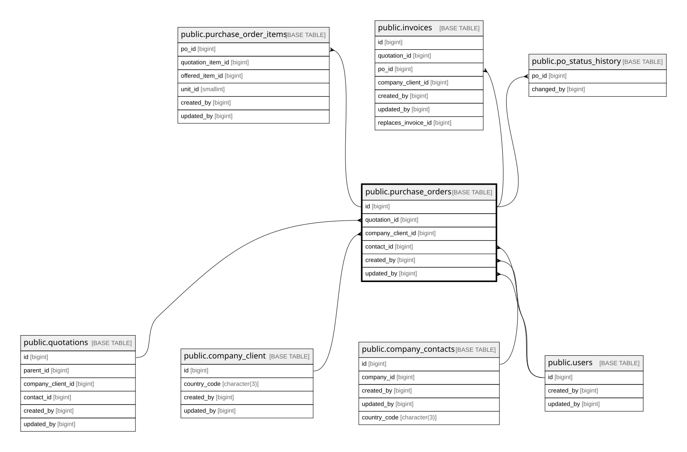

# public.purchase_orders

## Columns

| Name                 | Type                     | Default                                     | Nullable | Children                                                                                            | Parents                                               | Comment                                                                                                                             |
| -------------------- | ------------------------ | ------------------------------------------- | -------- | --------------------------------------------------------------------------------------------------- | ----------------------------------------------------- | ----------------------------------------------------------------------------------------------------------------------------------- |
| id                   | bigint                   | nextval('purchase_orders_id_seq'::regclass) | false    | [public.purchase_order_items](public.purchase_order_items.md) [public.invoices](public.invoices.md) |                                                       |                                                                                                                                     |
| po_number            | varchar(50)              |                                             | false    |                                                                                                     |                                                       |                                                                                                                                     |
| quotation_id         | bigint                   |                                             | false    |                                                                                                     | [public.quotations](public.quotations.md)             |                                                                                                                                     |
| company_client_id    | bigint                   |                                             | false    |                                                                                                     | [public.company_client](public.company_client.md)     |                                                                                                                                     |
| contact_id           | bigint                   |                                             | true     |                                                                                                     | [public.company_contacts](public.company_contacts.md) |                                                                                                                                     |
| po_date              | date                     |                                             | false    |                                                                                                     |                                                       |                                                                                                                                     |
| status               | varchar(20)              | 'PENDING'::character varying                | false    |                                                                                                     |                                                       |                                                                                                                                     |
| delivery_note_number | varchar(50)              |                                             | true     |                                                                                                     |                                                       |                                                                                                                                     |
| notes                | text                     |                                             | true     |                                                                                                     |                                                       |                                                                                                                                     |
| file_url             | text                     |                                             | true     |                                                                                                     |                                                       |                                                                                                                                     |
| row_version          | integer                  | 0                                           | false    |                                                                                                     |                                                       |                                                                                                                                     |
| created_by           | bigint                   |                                             | false    |                                                                                                     | [public.users](public.users.md)                       |                                                                                                                                     |
| updated_by           | bigint                   |                                             | true     |                                                                                                     | [public.users](public.users.md)                       |                                                                                                                                     |
| created_at           | timestamp with time zone | now()                                       | false    |                                                                                                     |                                                       |                                                                                                                                     |
| updated_at           | timestamp with time zone | now()                                       | false    |                                                                                                     |                                                       |                                                                                                                                     |
| discount_pct         | numeric(5,2)             |                                             | false    |                                                                                                     |                                                       | Discount % for this PO (0..100), snapshot from quotation at PO creation time. Auto-inherited via trg_po_inherit_quotation_discount. |
| file_name            | varchar(255)             |                                             | true     |                                                                                                     |                                                       |                                                                                                                                     |
| file_size            | bigint                   |                                             | true     |                                                                                                     |                                                       |                                                                                                                                     |
| uploaded_at          | timestamp with time zone |                                             | true     |                                                                                                     |                                                       |                                                                                                                                     |

## Constraints

| Name                                       | Type        | Definition                                                                                                                                                                      |
| ------------------------------------------ | ----------- | ------------------------------------------------------------------------------------------------------------------------------------------------------------------------------- |
| purchase_orders_company_client_id_not_null | n           | NOT NULL company_client_id                                                                                                                                                      |
| purchase_orders_created_at_not_null        | n           | NOT NULL created_at                                                                                                                                                             |
| purchase_orders_created_by_not_null        | n           | NOT NULL created_by                                                                                                                                                             |
| purchase_orders_discount_pct_check         | CHECK       | CHECK (((discount_pct >= (0)::numeric) AND (discount_pct <= (100)::numeric)))                                                                                                   |
| purchase_orders_discount_pct_not_null      | n           | NOT NULL discount_pct                                                                                                                                                           |
| purchase_orders_id_not_null                | n           | NOT NULL id                                                                                                                                                                     |
| purchase_orders_po_date_not_null           | n           | NOT NULL po_date                                                                                                                                                                |
| purchase_orders_po_number_not_null         | n           | NOT NULL po_number                                                                                                                                                              |
| purchase_orders_quotation_id_not_null      | n           | NOT NULL quotation_id                                                                                                                                                           |
| purchase_orders_row_version_not_null       | n           | NOT NULL row_version                                                                                                                                                            |
| purchase_orders_status_check               | CHECK       | CHECK (((status)::text = ANY ((ARRAY['PENDING'::character varying, 'UPLOADED'::character varying, 'ON_PROGRESS'::character varying, 'DELIVERED'::character varying])::text[]))) |
| purchase_orders_status_not_null            | n           | NOT NULL status                                                                                                                                                                 |
| purchase_orders_updated_at_not_null        | n           | NOT NULL updated_at                                                                                                                                                             |
| purchase_orders_created_by_fkey            | FOREIGN KEY | FOREIGN KEY (created_by) REFERENCES users(id) ON DELETE RESTRICT                                                                                                                |
| purchase_orders_updated_by_fkey            | FOREIGN KEY | FOREIGN KEY (updated_by) REFERENCES users(id) ON DELETE RESTRICT                                                                                                                |
| purchase_orders_company_client_id_fkey     | FOREIGN KEY | FOREIGN KEY (company_client_id) REFERENCES company_client(id) ON DELETE RESTRICT                                                                                                |
| purchase_orders_contact_id_fkey            | FOREIGN KEY | FOREIGN KEY (contact_id) REFERENCES company_contacts(id) ON DELETE SET NULL                                                                                                     |
| purchase_orders_quotation_id_fkey          | FOREIGN KEY | FOREIGN KEY (quotation_id) REFERENCES quotations(id) ON DELETE RESTRICT                                                                                                         |
| purchase_orders_pkey                       | PRIMARY KEY | PRIMARY KEY (id)                                                                                                                                                                |
| purchase_orders_po_number_key              | UNIQUE      | UNIQUE (po_number)                                                                                                                                                              |

## Indexes

| Name                          | Definition                                                                                          |
| ----------------------------- | --------------------------------------------------------------------------------------------------- |
| purchase_orders_pkey          | CREATE UNIQUE INDEX purchase_orders_pkey ON public.purchase_orders USING btree (id)                 |
| purchase_orders_po_number_key | CREATE UNIQUE INDEX purchase_orders_po_number_key ON public.purchase_orders USING btree (po_number) |
| idx_po_quotation              | CREATE INDEX idx_po_quotation ON public.purchase_orders USING btree (quotation_id)                  |
| idx_po_company                | CREATE INDEX idx_po_company ON public.purchase_orders USING btree (company_client_id)               |
| idx_po_status_date            | CREATE INDEX idx_po_status_date ON public.purchase_orders USING btree (status, po_date DESC)        |

## Triggers

| Name                              | Definition                                                                                                                                                    |
| --------------------------------- | ------------------------------------------------------------------------------------------------------------------------------------------------------------- |
| trg_purchase_orders_updated_at    | CREATE TRIGGER trg_purchase_orders_updated_at BEFORE UPDATE ON public.purchase_orders FOR EACH ROW EXECUTE FUNCTION set_updated_at()                          |
| trg_po_inherit_quotation_discount | CREATE TRIGGER trg_po_inherit_quotation_discount BEFORE INSERT ON public.purchase_orders FOR EACH ROW EXECUTE FUNCTION trg_fn_po_inherit_quotation_discount() |

## Relations

---

> Generated by [tbls](https://github.com/k1LoW/tbls)
