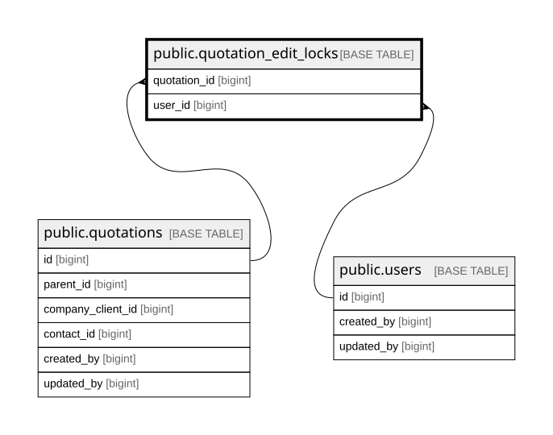

# public.quotation_edit_locks

## Columns

| Name         | Type                     | Default | Nullable | Children | Parents                                   | Comment |
| ------------ | ------------------------ | ------- | -------- | -------- | ----------------------------------------- | ------- |
| quotation_id | bigint                   |         | false    |          | [public.quotations](public.quotations.md) |         |
| part         | text                     |         | false    |          |                                           |         |
| user_id      | bigint                   |         | false    |          | [public.users](public.users.md)           |         |
| expires_at   | timestamp with time zone |         | false    |          |                                           |         |

## Constraints

| Name                                       | Type        | Definition                                                               |
| ------------------------------------------ | ----------- | ------------------------------------------------------------------------ |
| quotation_edit_locks_expires_at_not_null   | n           | NOT NULL expires_at                                                      |
| quotation_edit_locks_part_check            | CHECK       | CHECK (((part = 'header'::text) OR (part ~ '^line:[1-9][0-9]*$'::text))) |
| quotation_edit_locks_part_not_null         | n           | NOT NULL part                                                            |
| quotation_edit_locks_quotation_id_not_null | n           | NOT NULL quotation_id                                                    |
| quotation_edit_locks_user_id_not_null      | n           | NOT NULL user_id                                                         |
| quotation_edit_locks_user_id_fkey          | FOREIGN KEY | FOREIGN KEY (user_id) REFERENCES users(id)                               |
| quotation_edit_locks_quotation_id_fkey     | FOREIGN KEY | FOREIGN KEY (quotation_id) REFERENCES quotations(id) ON DELETE CASCADE   |
| quotation_edit_locks_pkey                  | PRIMARY KEY | PRIMARY KEY (quotation_id, part)                                         |

## Indexes

| Name                      | Definition                                                                                                    |
| ------------------------- | ------------------------------------------------------------------------------------------------------------- |
| quotation_edit_locks_pkey | CREATE UNIQUE INDEX quotation_edit_locks_pkey ON public.quotation_edit_locks USING btree (quotation_id, part) |

## Relations

---

> Generated by [tbls](https://github.com/k1LoW/tbls)
