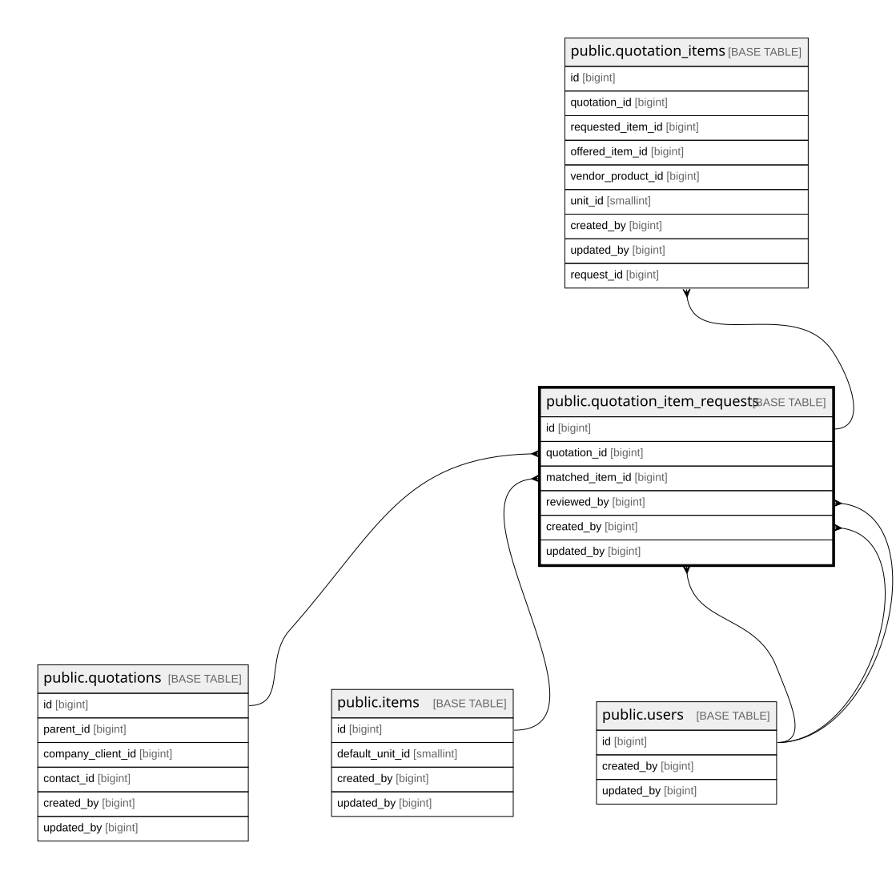

# public.quotation_item_requests

## Columns

| Name            | Type                     | Default                                             | Nullable | Children                                            | Parents                                   | Comment |
| --------------- | ------------------------ | --------------------------------------------------- | -------- | --------------------------------------------------- | ----------------------------------------- | ------- |
| id              | bigint                   | nextval('quotation_item_requests_id_seq'::regclass) | false    | [public.quotation_items](public.quotation_items.md) |                                           |         |
| quotation_id    | bigint                   |                                                     | false    |                                                     | [public.quotations](public.quotations.md) |         |
| line_no         | integer                  |                                                     | false    |                                                     |                                           |         |
| request_text    | text                     |                                                     | false    |                                                     |                                           |         |
| request_impa    | varchar(20)              |                                                     | true     |                                                     |                                           |         |
| requested_qty   | numeric(15,3)            |                                                     | true     |                                                     |                                           |         |
| requested_uom   | varchar(20)              |                                                     | true     |                                                     |                                           |         |
| matched_item_id | bigint                   |                                                     | true     |                                                     | [public.items](public.items.md)           |         |
| match_status    | varchar(20)              | 'pending'::character varying                        | false    |                                                     |                                           |         |
| source_type     | varchar(20)              | 'manual'::character varying                         | false    |                                                     |                                           |         |
| source_ref      | text                     |                                                     | true     |                                                     |                                           |         |
| notes           | text                     |                                                     | true     |                                                     |                                           |         |
| reviewed_by     | bigint                   |                                                     | true     |                                                     | [public.users](public.users.md)           |         |
| reviewed_at     | timestamp with time zone |                                                     | true     |                                                     |                                           |         |
| row_version     | integer                  | 0                                                   | false    |                                                     |                                           |         |
| created_by      | bigint                   |                                                     | false    |                                                     | [public.users](public.users.md)           |         |
| updated_by      | bigint                   |                                                     | true     |                                                     | [public.users](public.users.md)           |         |
| created_at      | timestamp with time zone | now()                                               | false    |                                                     |                                           |         |
| updated_at      | timestamp with time zone | now()                                               | false    |                                                     |                                           |         |

## Constraints

| Name                                          | Type        | Definition                                                                                                                                                                             |
| --------------------------------------------- | ----------- | -------------------------------------------------------------------------------------------------------------------------------------------------------------------------------------- |
| ck_qir_qty_positive                           | CHECK       | CHECK (((requested_qty IS NULL) OR (requested_qty > (0)::numeric)))                                                                                                                    |
| quotation_item_requests_created_at_not_null   | n           | NOT NULL created_at                                                                                                                                                                    |
| quotation_item_requests_created_by_not_null   | n           | NOT NULL created_by                                                                                                                                                                    |
| quotation_item_requests_id_not_null           | n           | NOT NULL id                                                                                                                                                                            |
| quotation_item_requests_line_no_not_null      | n           | NOT NULL line_no                                                                                                                                                                       |
| quotation_item_requests_match_status_check    | CHECK       | CHECK (((match_status)::text = ANY ((ARRAY['pending'::character varying, 'matched'::character varying, 'substituted'::character varying, 'unavailable'::character varying])::text[]))) |
| quotation_item_requests_match_status_not_null | n           | NOT NULL match_status                                                                                                                                                                  |
| quotation_item_requests_quotation_id_not_null | n           | NOT NULL quotation_id                                                                                                                                                                  |
| quotation_item_requests_request_text_not_null | n           | NOT NULL request_text                                                                                                                                                                  |
| quotation_item_requests_row_version_not_null  | n           | NOT NULL row_version                                                                                                                                                                   |
| quotation_item_requests_source_type_check     | CHECK       | CHECK (((source_type)::text = ANY ((ARRAY['manual'::character varying, 'ocr'::character varying, 'import'::character varying])::text[])))                                              |
| quotation_item_requests_source_type_not_null  | n           | NOT NULL source_type                                                                                                                                                                   |
| quotation_item_requests_updated_at_not_null   | n           | NOT NULL updated_at                                                                                                                                                                    |
| quotation_item_requests_created_by_fkey       | FOREIGN KEY | FOREIGN KEY (created_by) REFERENCES users(id)                                                                                                                                          |
| quotation_item_requests_reviewed_by_fkey      | FOREIGN KEY | FOREIGN KEY (reviewed_by) REFERENCES users(id)                                                                                                                                         |
| quotation_item_requests_updated_by_fkey       | FOREIGN KEY | FOREIGN KEY (updated_by) REFERENCES users(id)                                                                                                                                          |
| quotation_item_requests_matched_item_id_fkey  | FOREIGN KEY | FOREIGN KEY (matched_item_id) REFERENCES items(id) ON DELETE RESTRICT                                                                                                                  |
| quotation_item_requests_quotation_id_fkey     | FOREIGN KEY | FOREIGN KEY (quotation_id) REFERENCES quotations(id) ON DELETE CASCADE                                                                                                                 |
| quotation_item_requests_pkey                  | PRIMARY KEY | PRIMARY KEY (id)                                                                                                                                                                       |
| uq_qir_quotation_line                         | UNIQUE      | UNIQUE (quotation_id, line_no)                                                                                                                                                         |

## Indexes

| Name                         | Definition                                                                                                                            |
| ---------------------------- | ------------------------------------------------------------------------------------------------------------------------------------- |
| quotation_item_requests_pkey | CREATE UNIQUE INDEX quotation_item_requests_pkey ON public.quotation_item_requests USING btree (id)                                   |
| uq_qir_quotation_line        | CREATE UNIQUE INDEX uq_qir_quotation_line ON public.quotation_item_requests USING btree (quotation_id, line_no)                       |
| idx_qir_quotation            | CREATE INDEX idx_qir_quotation ON public.quotation_item_requests USING btree (quotation_id, line_no)                                  |
| idx_qir_matched_item         | CREATE INDEX idx_qir_matched_item ON public.quotation_item_requests USING btree (matched_item_id) WHERE (matched_item_id IS NOT NULL) |
| idx_qir_text_trgm            | CREATE INDEX idx_qir_text_trgm ON public.quotation_item_requests USING gin (request_text gin_trgm_ops)                                |
| idx_qir_status               | CREATE INDEX idx_qir_status ON public.quotation_item_requests USING btree (match_status)                                              |
| idx_qir_source               | CREATE INDEX idx_qir_source ON public.quotation_item_requests USING btree (source_type) WHERE ((source_type)::text <> 'manual'::text) |

## Triggers

| Name                | Definition                                                                                                                                                    |
| ------------------- | ------------------------------------------------------------------------------------------------------------------------------------------------------------- |
| trg_qir_lock_parent | CREATE TRIGGER trg_qir_lock_parent BEFORE INSERT OR DELETE OR UPDATE ON public.quotation_item_requests FOR EACH ROW EXECUTE FUNCTION trg_fn_qir_lock_parent() |
| trg_qir_updated_at  | CREATE TRIGGER trg_qir_updated_at BEFORE UPDATE ON public.quotation_item_requests FOR EACH ROW EXECUTE FUNCTION set_updated_at()                              |

## Relations

---

> Generated by [tbls](https://github.com/k1LoW/tbls)
