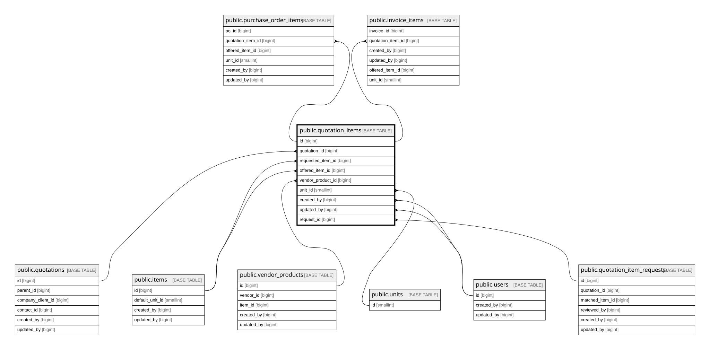

# public.quotation_items

## Columns

| Name                | Type                     | Default                                     | Nullable | Extra Definition                                                                                                                                                                                                       | Children                                                                                                      | Parents                                                             | Comment                                                                                                                                                                               |
| ------------------- | ------------------------ | ------------------------------------------- | -------- | ---------------------------------------------------------------------------------------------------------------------------------------------------------------------------------------------------------------------- | ------------------------------------------------------------------------------------------------------------- | ------------------------------------------------------------------- | ------------------------------------------------------------------------------------------------------------------------------------------------------------------------------------- |
| id                  | bigint                   | nextval('quotation_items_id_seq'::regclass) | false    |                                                                                                                                                                                                                        | [public.purchase_order_items](public.purchase_order_items.md) [public.invoice_items](public.invoice_items.md) |                                                                     |                                                                                                                                                                                       |
| quotation_id        | bigint                   |                                             | false    |                                                                                                                                                                                                                        |                                                                                                               | [public.quotations](public.quotations.md)                           |                                                                                                                                                                                       |
| line_number         | smallint                 |                                             | false    |                                                                                                                                                                                                                        |                                                                                                               |                                                                     |                                                                                                                                                                                       |
| item_type           | varchar(20)              |                                             | false    |                                                                                                                                                                                                                        |                                                                                                               |                                                                     |                                                                                                                                                                                       |
| requested_item_id   | bigint                   |                                             | true     |                                                                                                                                                                                                                        |                                                                                                               | [public.items](public.items.md)                                     |                                                                                                                                                                                       |
| requested_impa      | varchar(20)              |                                             | true     |                                                                                                                                                                                                                        |                                                                                                               |                                                                     |                                                                                                                                                                                       |
| requested_name      | text                     |                                             | false    |                                                                                                                                                                                                                        |                                                                                                               |                                                                     | Snapshot of client request text; not FK. requested_item_id is NULL if item is unknown in master.                                                                                      |
| offered_item_id     | bigint                   |                                             | true     |                                                                                                                                                                                                                        |                                                                                                               | [public.items](public.items.md)                                     |                                                                                                                                                                                       |
| vendor_product_id   | bigint                   |                                             | true     |                                                                                                                                                                                                                        |                                                                                                               | [public.vendor_products](public.vendor_products.md)                 |                                                                                                                                                                                       |
| qty                 | numeric(12,2)            |                                             | false    |                                                                                                                                                                                                                        |                                                                                                               |                                                                     |                                                                                                                                                                                       |
| unit_id             | smallint                 |                                             | true     |                                                                                                                                                                                                                        |                                                                                                               | [public.units](public.units.md)                                     |                                                                                                                                                                                       |
| selling_price       | numeric(15,2)            |                                             | false    |                                                                                                                                                                                                                        |                                                                                                               |                                                                     |                                                                                                                                                                                       |
| cost_price          | numeric(15,2)            |                                             | true     |                                                                                                                                                                                                                        |                                                                                                               |                                                                     |                                                                                                                                                                                       |
| total_selling       | numeric(15,2)            |                                             | true     | GENERATED ALWAYS AS (qty * selling_price) STORED                                                                                                                                                                       |                                                                                                               |                                                                     |                                                                                                                                                                                       |
| total_cost          | numeric(15,2)            |                                             | true     | GENERATED ALWAYS AS (qty * cost_price) STORED                                                                                                                                                                          |                                                                                                               |                                                                     |                                                                                                                                                                                       |
| profit_amount       | numeric(15,2)            |                                             | true     | GENERATED ALWAYS AS (qty * (selling_price - cost_price)) STORED                                                                                                                                                        |                                                                                                               |                                                                     |                                                                                                                                                                                       |
| profit_pct          | numeric(7,4)             |                                             | true     | GENERATED ALWAYS AS ((selling_price - cost_price) / NULLIF(cost_price, (0)::numeric)) STORED                                                                                                                           |                                                                                                               |                                                                     |                                                                                                                                                                                       |
| is_available        | boolean                  | true                                        | false    |                                                                                                                                                                                                                        |                                                                                                               |                                                                     |                                                                                                                                                                                       |
| ship_destination    | varchar(255)             |                                             | true     |                                                                                                                                                                                                                        |                                                                                                               |                                                                     |                                                                                                                                                                                       |
| due_date            | date                     |                                             | true     |                                                                                                                                                                                                                        |                                                                                                               |                                                                     |                                                                                                                                                                                       |
| row_version         | integer                  | 0                                           | false    |                                                                                                                                                                                                                        |                                                                                                               |                                                                     |                                                                                                                                                                                       |
| created_by          | bigint                   |                                             | false    |                                                                                                                                                                                                                        |                                                                                                               | [public.users](public.users.md)                                     |                                                                                                                                                                                       |
| updated_by          | bigint                   |                                             | true     |                                                                                                                                                                                                                        |                                                                                                               | [public.users](public.users.md)                                     |                                                                                                                                                                                       |
| created_at          | timestamp with time zone | now()                                       | false    |                                                                                                                                                                                                                        |                                                                                                               |                                                                     |                                                                                                                                                                                       |
| updated_at          | timestamp with time zone | now()                                       | false    |                                                                                                                                                                                                                        |                                                                                                               |                                                                     |                                                                                                                                                                                       |
| update_vendor_price | boolean                  | false                                       | false    |                                                                                                                                                                                                                        |                                                                                                               |                                                                     | Flag: set TRUE by app layer to sync vendor_products.cost_price with this row. Trigger fires AFTER INSERT only, not UPDATE, so draft iterations do not pollute master.                 |
| discount_pct        | numeric(5,2)             |                                             | false    |                                                                                                                                                                                                                        |                                                                                                               |                                                                     | Snapshot of discount_pct from quotations header (0..100). Auto-inherited via trg_inherit_quotation_discount BEFORE INSERT. Header UPDATE cascades via trg_cascade_quotation_discount. |
| discount_amount     | numeric(15,2)            |                                             | true     | GENERATED ALWAYS AS  CASE     WHEN ((item_type)::text = 'product'::text) THEN ((qty * selling_price) * (discount_pct / (100)::numeric))     ELSE (0)::numeric END STORED                           |                                                                                                               |                                                                     |                                                                                                                                                                                       |
| subtotal            | numeric(15,2)            |                                             | true     | GENERATED ALWAYS AS  CASE     WHEN ((item_type)::text = 'product'::text) THEN ((qty * selling_price) * ((1)::numeric - (discount_pct / (100)::numeric)))     ELSE (qty * selling_price) END STORED |                                                                                                               |                                                                     |                                                                                                                                                                                       |
| request_id          | bigint                   |                                             | true     |                                                                                                                                                                                                                        |                                                                                                               | [public.quotation_item_requests](public.quotation_item_requests.md) |                                                                                                                                                                                       |

## Constraints

| Name                                         | Type        | Definition                                                                                                       |
| -------------------------------------------- | ----------- | ---------------------------------------------------------------------------------------------------------------- |
| quotation_items_created_at_not_null          | n           | NOT NULL created_at                                                                                              |
| quotation_items_created_by_not_null          | n           | NOT NULL created_by                                                                                              |
| quotation_items_discount_pct_check           | CHECK       | CHECK (((discount_pct >= (0)::numeric) AND (discount_pct <= (100)::numeric)))                                    |
| quotation_items_discount_pct_not_null        | n           | NOT NULL discount_pct                                                                                            |
| quotation_items_id_not_null                  | n           | NOT NULL id                                                                                                      |
| quotation_items_is_available_not_null        | n           | NOT NULL is_available                                                                                            |
| quotation_items_item_type_check              | CHECK       | CHECK (((item_type)::text = ANY ((ARRAY['product'::character varying, 'shipping'::character varying])::text[]))) |
| quotation_items_item_type_not_null           | n           | NOT NULL item_type                                                                                               |
| quotation_items_line_number_not_null         | n           | NOT NULL line_number                                                                                             |
| quotation_items_qty_check                    | CHECK       | CHECK ((qty >= (0)::numeric))                                                                                    |
| quotation_items_qty_not_null                 | n           | NOT NULL qty                                                                                                     |
| quotation_items_quotation_id_not_null        | n           | NOT NULL quotation_id                                                                                            |
| quotation_items_requested_name_not_null      | n           | NOT NULL requested_name                                                                                          |
| quotation_items_row_version_not_null         | n           | NOT NULL row_version                                                                                             |
| quotation_items_selling_price_check          | CHECK       | CHECK ((selling_price >= (0)::numeric))                                                                          |
| quotation_items_selling_price_not_null       | n           | NOT NULL selling_price                                                                                           |
| quotation_items_update_vendor_price_not_null | n           | NOT NULL update_vendor_price                                                                                     |
| quotation_items_updated_at_not_null          | n           | NOT NULL updated_at                                                                                              |
| quotation_items_created_by_fkey              | FOREIGN KEY | FOREIGN KEY (created_by) REFERENCES users(id) ON DELETE RESTRICT                                                 |
| quotation_items_updated_by_fkey              | FOREIGN KEY | FOREIGN KEY (updated_by) REFERENCES users(id) ON DELETE RESTRICT                                                 |
| quotation_items_unit_id_fkey                 | FOREIGN KEY | FOREIGN KEY (unit_id) REFERENCES units(id) ON DELETE RESTRICT                                                    |
| quotation_items_offered_item_id_fkey         | FOREIGN KEY | FOREIGN KEY (offered_item_id) REFERENCES items(id) ON DELETE RESTRICT                                            |
| quotation_items_requested_item_id_fkey       | FOREIGN KEY | FOREIGN KEY (requested_item_id) REFERENCES items(id) ON DELETE RESTRICT                                          |
| quotation_items_vendor_product_id_fkey       | FOREIGN KEY | FOREIGN KEY (vendor_product_id) REFERENCES vendor_products(id) ON DELETE RESTRICT                                |
| quotation_items_quotation_id_fkey            | FOREIGN KEY | FOREIGN KEY (quotation_id) REFERENCES quotations(id) ON DELETE CASCADE                                           |
| quotation_items_pkey                         | PRIMARY KEY | PRIMARY KEY (id)                                                                                                 |
| quotation_items_quotation_id_line_number_key | UNIQUE      | UNIQUE (quotation_id, line_number)                                                                               |
| quotation_items_request_id_fkey              | FOREIGN KEY | FOREIGN KEY (request_id) REFERENCES quotation_item_requests(id) ON DELETE SET NULL                               |

## Indexes

| Name                                         | Definition                                                                                                                         |
| -------------------------------------------- | ---------------------------------------------------------------------------------------------------------------------------------- |
| quotation_items_pkey                         | CREATE UNIQUE INDEX quotation_items_pkey ON public.quotation_items USING btree (id)                                                |
| quotation_items_quotation_id_line_number_key | CREATE UNIQUE INDEX quotation_items_quotation_id_line_number_key ON public.quotation_items USING btree (quotation_id, line_number) |
| idx_quotation_items_quotation                | CREATE INDEX idx_quotation_items_quotation ON public.quotation_items USING btree (quotation_id)                                    |
| idx_quotation_items_offered_item             | CREATE INDEX idx_quotation_items_offered_item ON public.quotation_items USING btree (offered_item_id)                              |
| idx_quotation_items_requested_item           | CREATE INDEX idx_quotation_items_requested_item ON public.quotation_items USING btree (requested_item_id)                          |
| idx_quotation_items_vendor_product           | CREATE INDEX idx_quotation_items_vendor_product ON public.quotation_items USING btree (vendor_product_id)                          |
| idx_quotation_items_request                  | CREATE INDEX idx_quotation_items_request ON public.quotation_items USING btree (request_id) WHERE (request_id IS NOT NULL)         |

## Triggers

| Name                           | Definition                                                                                                                                              |
| ------------------------------ | ------------------------------------------------------------------------------------------------------------------------------------------------------- |
| trg_quotation_items_updated_at | CREATE TRIGGER trg_quotation_items_updated_at BEFORE UPDATE ON public.quotation_items FOR EACH ROW EXECUTE FUNCTION set_updated_at()                    |
| trg_sync_vendor_cost           | CREATE TRIGGER trg_sync_vendor_cost AFTER INSERT ON public.quotation_items FOR EACH ROW EXECUTE FUNCTION trg_fn_sync_vendor_cost()                      |
| trg_learn_match                | CREATE TRIGGER trg_learn_match AFTER INSERT ON public.quotation_items FOR EACH ROW EXECUTE FUNCTION trg_fn_learn_match()                                |
| trg_inherit_quotation_discount | CREATE TRIGGER trg_inherit_quotation_discount BEFORE INSERT ON public.quotation_items FOR EACH ROW EXECUTE FUNCTION trg_fn_inherit_quotation_discount() |

## Relations

---

> Generated by [tbls](https://github.com/k1LoW/tbls)
