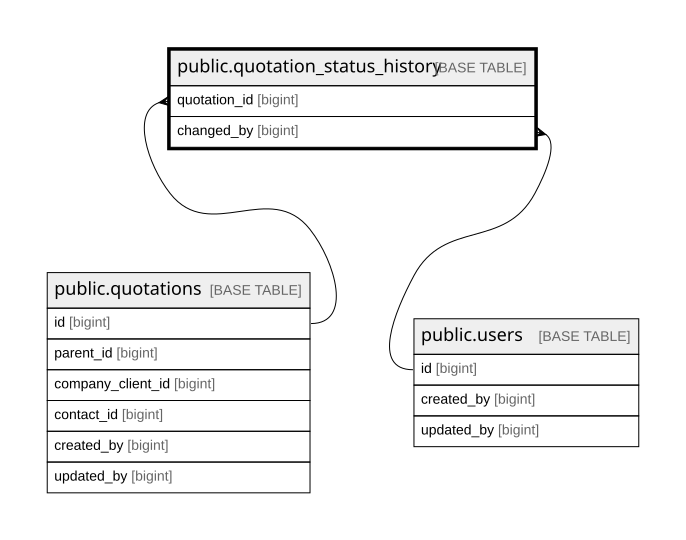

# public.quotation_status_history

## Description

Quotation status change timeline. Populated by trg_log_quotation_creation (initial) and fn_change_quotation_status (subsequent). Used by FE Detail page to render timeline.

## Columns

| Name         | Type                     | Default                                              | Nullable | Children | Parents                                   | Comment |
| ------------ | ------------------------ | ---------------------------------------------------- | -------- | -------- | ----------------------------------------- | ------- |
| id           | bigint                   | nextval('quotation_status_history_id_seq'::regclass) | false    |          |                                           |         |
| quotation_id | bigint                   |                                                      | false    |          | [public.quotations](public.quotations.md) |         |
| from_status  | varchar(20)              |                                                      | true     |          |                                           |         |
| to_status    | varchar(20)              |                                                      | false    |          |                                           |         |
| note         | text                     |                                                      | true     |          |                                           |         |
| changed_by   | bigint                   |                                                      | false    |          | [public.users](public.users.md)           |         |
| changed_at   | timestamp with time zone | now()                                                | false    |          |                                           |         |

## Constraints

| Name                                           | Type        | Definition                                                             |
| ---------------------------------------------- | ----------- | ---------------------------------------------------------------------- |
| quotation_status_history_changed_at_not_null   | n           | NOT NULL changed_at                                                    |
| quotation_status_history_changed_by_not_null   | n           | NOT NULL changed_by                                                    |
| quotation_status_history_id_not_null           | n           | NOT NULL id                                                            |
| quotation_status_history_quotation_id_not_null | n           | NOT NULL quotation_id                                                  |
| quotation_status_history_to_status_not_null    | n           | NOT NULL to_status                                                     |
| quotation_status_history_changed_by_fkey       | FOREIGN KEY | FOREIGN KEY (changed_by) REFERENCES users(id) ON DELETE RESTRICT       |
| quotation_status_history_quotation_id_fkey     | FOREIGN KEY | FOREIGN KEY (quotation_id) REFERENCES quotations(id) ON DELETE CASCADE |
| quotation_status_history_pkey                  | PRIMARY KEY | PRIMARY KEY (id)                                                       |

## Indexes

| Name                                   | Definition                                                                                                                         |
| -------------------------------------- | ---------------------------------------------------------------------------------------------------------------------------------- |
| quotation_status_history_pkey          | CREATE UNIQUE INDEX quotation_status_history_pkey ON public.quotation_status_history USING btree (id)                              |
| idx_quotation_status_history_quotation | CREATE INDEX idx_quotation_status_history_quotation ON public.quotation_status_history USING btree (quotation_id, changed_at DESC) |

## Relations

---

> Generated by [tbls](https://github.com/k1LoW/tbls)
