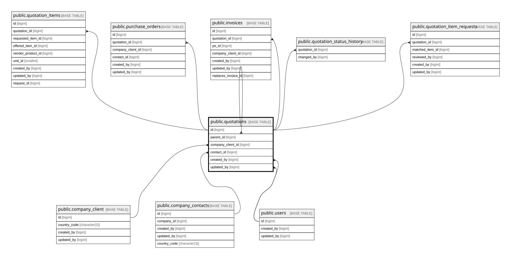

# public.quotations

## Columns

| Name                | Type                     | Default                                | Nullable | Extra Definition                                                               | Children                                                                                                                                                                                                                                                                                                                          | Parents                                               | Comment                                                                                                                                                                                                   |
| ------------------- | ------------------------ | -------------------------------------- | -------- | ------------------------------------------------------------------------------ | --------------------------------------------------------------------------------------------------------------------------------------------------------------------------------------------------------------------------------------------------------------------------------------------------------------------------------- | ----------------------------------------------------- | --------------------------------------------------------------------------------------------------------------------------------------------------------------------------------------------------------- |
| id                  | bigint                   | nextval('quotations_id_seq'::regclass) | false    |                                                                                | [public.quotations](public.quotations.md) [public.quotation_items](public.quotation_items.md) [public.purchase_orders](public.purchase_orders.md) [public.invoices](public.invoices.md) [public.quotation_status_history](public.quotation_status_history.md) [public.quotation_item_requests](public.quotation_item_requests.md) |                                                       |                                                                                                                                                                                                           |
| quotation_no        | varchar(50)              |                                        | false    |                                                                                |                                                                                                                                                                                                                                                                                                                                   |                                                       |                                                                                                                                                                                                           |
| version             | integer                  | 1                                      | false    |                                                                                |                                                                                                                                                                                                                                                                                                                                   |                                                       |                                                                                                                                                                                                           |
| parent_id           | bigint                   |                                        | true     |                                                                                |                                                                                                                                                                                                                                                                                                                                   | [public.quotations](public.quotations.md)             |                                                                                                                                                                                                           |
| company_client_id   | bigint                   |                                        | false    |                                                                                |                                                                                                                                                                                                                                                                                                                                   | [public.company_client](public.company_client.md)     |                                                                                                                                                                                                           |
| company_client_name | varchar(255)             |                                        | false    |                                                                                |                                                                                                                                                                                                                                                                                                                                   |                                                       | Snapshot of company name at creation; not FK to keep legal doc immutable.                                                                                                                                 |
| contact_id          | bigint                   |                                        | true     |                                                                                |                                                                                                                                                                                                                                                                                                                                   | [public.company_contacts](public.company_contacts.md) |                                                                                                                                                                                                           |
| contact_name        | varchar(255)             |                                        | true     |                                                                                |                                                                                                                                                                                                                                                                                                                                   |                                                       | Snapshot of contact name; not FK to keep legal doc immutable.                                                                                                                                             |
| client_ref_no       | varchar(100)             |                                        | true     |                                                                                |                                                                                                                                                                                                                                                                                                                                   |                                                       |                                                                                                                                                                                                           |
| vessel_name         | varchar(255)             |                                        | true     |                                                                                |                                                                                                                                                                                                                                                                                                                                   |                                                       |                                                                                                                                                                                                           |
| status              | varchar(20)              | 'draft'::character varying             | false    |                                                                                |                                                                                                                                                                                                                                                                                                                                   |                                                       |                                                                                                                                                                                                           |
| notes               | text                     |                                        | true     |                                                                                |                                                                                                                                                                                                                                                                                                                                   |                                                       |                                                                                                                                                                                                           |
| payment_terms       | varchar(100)             |                                        | true     |                                                                                |                                                                                                                                                                                                                                                                                                                                   |                                                       |                                                                                                                                                                                                           |
| validity_days       | smallint                 |                                        | true     |                                                                                |                                                                                                                                                                                                                                                                                                                                   |                                                       |                                                                                                                                                                                                           |
| total_produk        | numeric(15,2)            |                                        | true     |                                                                                |                                                                                                                                                                                                                                                                                                                                   |                                                       |                                                                                                                                                                                                           |
| total               | numeric(15,2)            |                                        | true     |                                                                                |                                                                                                                                                                                                                                                                                                                                   |                                                       |                                                                                                                                                                                                           |
| total_discount      | numeric(15,2)            |                                        | true     |                                                                                |                                                                                                                                                                                                                                                                                                                                   |                                                       |                                                                                                                                                                                                           |
| subtotal            | numeric(15,2)            |                                        | true     | GENERATED ALWAYS AS (total - total_discount) STORED                            |                                                                                                                                                                                                                                                                                                                                   |                                                       |                                                                                                                                                                                                           |
| dpp_nilai_lain      | numeric(15,2)            |                                        | true     | GENERATED ALWAYS AS (((total - total_discount) * 11.0) / 12.0) STORED          |                                                                                                                                                                                                                                                                                                                                   |                                                       |                                                                                                                                                                                                           |
| ppn_amount          | numeric(15,2)            |                                        | true     | GENERATED ALWAYS AS ((((total - total_discount) * 11.0) / 12.0) * 0.12) STORED |                                                                                                                                                                                                                                                                                                                                   |                                                       |                                                                                                                                                                                                           |
| row_version         | integer                  | 0                                      | false    |                                                                                |                                                                                                                                                                                                                                                                                                                                   |                                                       |                                                                                                                                                                                                           |
| created_by          | bigint                   |                                        | false    |                                                                                |                                                                                                                                                                                                                                                                                                                                   | [public.users](public.users.md)                       |                                                                                                                                                                                                           |
| updated_by          | bigint                   |                                        | true     |                                                                                |                                                                                                                                                                                                                                                                                                                                   | [public.users](public.users.md)                       |                                                                                                                                                                                                           |
| created_at          | timestamp with time zone | now()                                  | false    |                                                                                |                                                                                                                                                                                                                                                                                                                                   |                                                       |                                                                                                                                                                                                           |
| updated_at          | timestamp with time zone | now()                                  | false    |                                                                                |                                                                                                                                                                                                                                                                                                                                   |                                                       |                                                                                                                                                                                                           |
| discount_pct        | numeric(5,2)             |                                        | false    |                                                                                |                                                                                                                                                                                                                                                                                                                                   |                                                       | Discount % applied to all items in this quotation (NUMERIC 0..100, e.g. 5 = 5%). No DB DEFAULT — app layer must set on INSERT. Once status != draft, UPDATE is blocked by trg_protect_quotation_discount. |
| grand_total         | numeric(15,2)            |                                        | true     | GENERATED ALWAYS AS ((total - total_discount) * 1.11) STORED                   |                                                                                                                                                                                                                                                                                                                                   |                                                       |                                                                                                                                                                                                           |

## Constraints

| Name                                    | Type        | Definition                                                                                                                                                                                                                         | Comment                                                                                                                                   |
| --------------------------------------- | ----------- | ---------------------------------------------------------------------------------------------------------------------------------------------------------------------------------------------------------------------------------- | ----------------------------------------------------------------------------------------------------------------------------------------- |
| quotations_company_client_id_not_null   | n           | NOT NULL company_client_id                                                                                                                                                                                                         |                                                                                                                                           |
| quotations_company_client_name_not_null | n           | NOT NULL company_client_name                                                                                                                                                                                                       |                                                                                                                                           |
| quotations_created_at_not_null          | n           | NOT NULL created_at                                                                                                                                                                                                                |                                                                                                                                           |
| quotations_created_by_not_null          | n           | NOT NULL created_by                                                                                                                                                                                                                |                                                                                                                                           |
| quotations_discount_pct_check           | CHECK       | CHECK (((discount_pct >= (0)::numeric) AND (discount_pct <= (100)::numeric)))                                                                                                                                                      |                                                                                                                                           |
| quotations_discount_pct_not_null        | n           | NOT NULL discount_pct                                                                                                                                                                                                              |                                                                                                                                           |
| quotations_id_not_null                  | n           | NOT NULL id                                                                                                                                                                                                                        |                                                                                                                                           |
| quotations_quotation_no_not_null        | n           | NOT NULL quotation_no                                                                                                                                                                                                              |                                                                                                                                           |
| quotations_row_version_not_null         | n           | NOT NULL row_version                                                                                                                                                                                                               |                                                                                                                                           |
| quotations_status_check                 | CHECK       | CHECK (((status)::text = ANY ((ARRAY['draft'::character varying, 'sent'::character varying, 'accepted'::character varying, 'rejected'::character varying, 'revision'::character varying, 'expired'::character varying])::text[]))) | Canonical status values. FE labels mapped in translation layer (FE), not in DB. expired = quotation past validity_days, set via job/cron. |
| quotations_status_not_null              | n           | NOT NULL status                                                                                                                                                                                                                    |                                                                                                                                           |
| quotations_updated_at_not_null          | n           | NOT NULL updated_at                                                                                                                                                                                                                |                                                                                                                                           |
| quotations_version_not_null             | n           | NOT NULL version                                                                                                                                                                                                                   |                                                                                                                                           |
| quotations_created_by_fkey              | FOREIGN KEY | FOREIGN KEY (created_by) REFERENCES users(id) ON DELETE RESTRICT                                                                                                                                                                   |                                                                                                                                           |
| quotations_updated_by_fkey              | FOREIGN KEY | FOREIGN KEY (updated_by) REFERENCES users(id) ON DELETE RESTRICT                                                                                                                                                                   |                                                                                                                                           |
| quotations_company_client_id_fkey       | FOREIGN KEY | FOREIGN KEY (company_client_id) REFERENCES company_client(id) ON DELETE RESTRICT                                                                                                                                                   |                                                                                                                                           |
| quotations_contact_id_fkey              | FOREIGN KEY | FOREIGN KEY (contact_id) REFERENCES company_contacts(id) ON DELETE SET NULL                                                                                                                                                        |                                                                                                                                           |
| quotations_parent_id_fkey               | FOREIGN KEY | FOREIGN KEY (parent_id) REFERENCES quotations(id) ON DELETE RESTRICT                                                                                                                                                               |                                                                                                                                           |
| quotations_pkey                         | PRIMARY KEY | PRIMARY KEY (id)                                                                                                                                                                                                                   |                                                                                                                                           |
| quotations_quotation_no_key             | UNIQUE      | UNIQUE (quotation_no)                                                                                                                                                                                                              |                                                                                                                                           |

## Indexes

| Name                          | Definition                                                                                            |
| ----------------------------- | ----------------------------------------------------------------------------------------------------- |
| quotations_pkey               | CREATE UNIQUE INDEX quotations_pkey ON public.quotations USING btree (id)                             |
| quotations_quotation_no_key   | CREATE UNIQUE INDEX quotations_quotation_no_key ON public.quotations USING btree (quotation_no)       |
| idx_quotations_company        | CREATE INDEX idx_quotations_company ON public.quotations USING btree (company_client_id)              |
| idx_quotations_contact        | CREATE INDEX idx_quotations_contact ON public.quotations USING btree (contact_id)                     |
| idx_quotations_parent         | CREATE INDEX idx_quotations_parent ON public.quotations USING btree (parent_id)                       |
| idx_quotations_status_created | CREATE INDEX idx_quotations_status_created ON public.quotations USING btree (status, created_at DESC) |

## Triggers

| Name                           | Definition                                                                                                                                                                                                                    |
| ------------------------------ | ----------------------------------------------------------------------------------------------------------------------------------------------------------------------------------------------------------------------------- |
| trg_quotations_updated_at      | CREATE TRIGGER trg_quotations_updated_at BEFORE UPDATE ON public.quotations FOR EACH ROW EXECUTE FUNCTION set_updated_at()                                                                                                    |
| trg_protect_quotation_discount | CREATE TRIGGER trg_protect_quotation_discount BEFORE UPDATE OF discount_pct ON public.quotations FOR EACH ROW EXECUTE FUNCTION trg_fn_protect_quotation_discount()                                                            |
| trg_cascade_quotation_discount | CREATE TRIGGER trg_cascade_quotation_discount AFTER UPDATE OF discount_pct ON public.quotations FOR EACH ROW WHEN ((old.discount_pct IS DISTINCT FROM new.discount_pct)) EXECUTE FUNCTION trg_fn_cascade_quotation_discount() |
| trg_log_quotation_creation     | CREATE TRIGGER trg_log_quotation_creation AFTER INSERT ON public.quotations FOR EACH ROW EXECUTE FUNCTION trg_fn_log_quotation_creation()                                                                                     |

## Relations

---

> Generated by [tbls](https://github.com/k1LoW/tbls)
