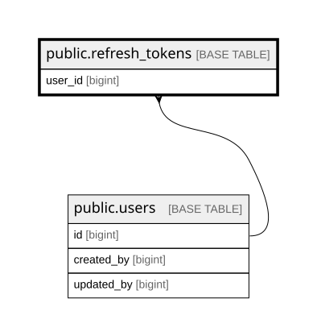

# public.refresh_tokens

## Description

Opaque refresh tokens (SHA-256 hashed). Rotation on use, revocation on logout.

## Columns

| Name            | Type                     | Default                                    | Nullable | Children | Parents                         | Comment                                                                                            |
| --------------- | ------------------------ | ------------------------------------------ | -------- | -------- | ------------------------------- | -------------------------------------------------------------------------------------------------- |
| id              | bigint                   | nextval('refresh_tokens_id_seq'::regclass) | false    |          |                                 |                                                                                                    |
| user_id         | bigint                   |                                            | false    |          | [public.users](public.users.md) |                                                                                                    |
| token_hash      | bytea                    |                                            | false    |          |                                 | SHA-256(token); never store the raw token. 32 bytes.                                               |
| expires_at      | timestamp with time zone |                                            | false    |          |                                 |                                                                                                    |
| created_at      | timestamp with time zone | now()                                      | false    |          |                                 |                                                                                                    |
| revoked_at      | timestamp with time zone |                                            | true     |          |                                 | Set when the token is consumed (rotated) or explicitly revoked. NULL = active.                     |
| revoked_reason  | text                     |                                            | true     |          |                                 | Why the token was revoked: rotated, logout, admin, reuse. NULL on legacy rows.                     |
| session_version | integer                  |                                            | false    |          |                                 | The owner's users.session_version when this token was minted. Redeemable only while the two match. |

## Constraints

| Name                                    | Type        | Definition                                                   |
| --------------------------------------- | ----------- | ------------------------------------------------------------ |
| refresh_tokens_created_at_not_null      | n           | NOT NULL created_at                                          |
| refresh_tokens_expires_at_not_null      | n           | NOT NULL expires_at                                          |
| refresh_tokens_id_not_null              | n           | NOT NULL id                                                  |
| refresh_tokens_session_version_not_null | n           | NOT NULL session_version                                     |
| refresh_tokens_token_hash_not_null      | n           | NOT NULL token_hash                                          |
| refresh_tokens_user_id_not_null         | n           | NOT NULL user_id                                             |
| refresh_tokens_user_id_fkey             | FOREIGN KEY | FOREIGN KEY (user_id) REFERENCES users(id) ON DELETE CASCADE |
| refresh_tokens_pkey                     | PRIMARY KEY | PRIMARY KEY (id)                                             |
| refresh_tokens_token_hash_key           | UNIQUE      | UNIQUE (token_hash)                                          |

## Indexes

| Name                          | Definition                                                                                          |
| ----------------------------- | --------------------------------------------------------------------------------------------------- |
| refresh_tokens_pkey           | CREATE UNIQUE INDEX refresh_tokens_pkey ON public.refresh_tokens USING btree (id)                   |
| refresh_tokens_token_hash_key | CREATE UNIQUE INDEX refresh_tokens_token_hash_key ON public.refresh_tokens USING btree (token_hash) |
| refresh_tokens_user_id_idx    | CREATE INDEX refresh_tokens_user_id_idx ON public.refresh_tokens USING btree (user_id)              |

## Relations

---

> Generated by [tbls](https://github.com/k1LoW/tbls)
