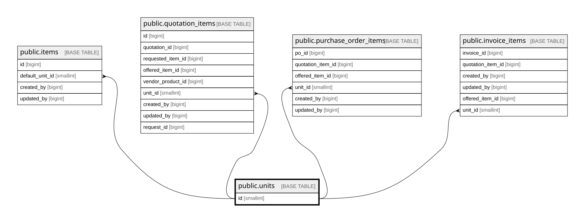

# public.units

## Columns

| Name         | Type        | Default                           | Nullable | Children                                                                                                                                                                                          | Parents | Comment |
| ------------ | ----------- | --------------------------------- | -------- | ------------------------------------------------------------------------------------------------------------------------------------------------------------------------------------------------- | ------- | ------- |
| id           | smallint    | nextval('units_id_seq'::regclass) | false    | [public.items](public.items.md) [public.quotation_items](public.quotation_items.md) [public.purchase_order_items](public.purchase_order_items.md) [public.invoice_items](public.invoice_items.md) |         |         |
| code         | varchar(20) |                                   | false    |                                                                                                                                                                                                   |         |         |
| name         | varchar(50) |                                   | true     |                                                                                                                                                                                                   |         |         |
| coretax_code | varchar(10) |                                   | true     |                                                                                                                                                                                                   |         |         |

## Constraints

| Name                | Type        | Definition       |
| ------------------- | ----------- | ---------------- |
| units_code_not_null | n           | NOT NULL code    |
| units_id_not_null   | n           | NOT NULL id      |
| units_pkey          | PRIMARY KEY | PRIMARY KEY (id) |
| units_code_key      | UNIQUE      | UNIQUE (code)    |

## Indexes

| Name           | Definition                                                            |
| -------------- | --------------------------------------------------------------------- |
| units_pkey     | CREATE UNIQUE INDEX units_pkey ON public.units USING btree (id)       |
| units_code_key | CREATE UNIQUE INDEX units_code_key ON public.units USING btree (code) |

## Relations

---

> Generated by [tbls](https://github.com/k1LoW/tbls)
