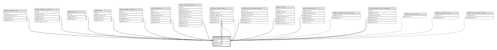

# public.users

## Columns

| Name          | Type                     | Default                           | Nullable | Children                                                                                                                                                                                                                                                                                                                                                                                                                                                                                                                                                                                                                                                                                                        | Parents                         | Comment |
| ------------- | ------------------------ | --------------------------------- | -------- | --------------------------------------------------------------------------------------------------------------------------------------------------------------------------------------------------------------------------------------------------------------------------------------------------------------------------------------------------------------------------------------------------------------------------------------------------------------------------------------------------------------------------------------------------------------------------------------------------------------------------------------------------------------------------------------------------------------- | ------------------------------- | ------- |
| id            | bigint                   | nextval('users_id_seq'::regclass) | false    | [public.users](public.users.md) [public.company_client](public.company_client.md) [public.company_contacts](public.company_contacts.md) [public.vendors](public.vendors.md) [public.items](public.items.md) [public.vendor_products](public.vendor_products.md) [public.quotations](public.quotations.md) [public.quotation_items](public.quotation_items.md) [public.purchase_orders](public.purchase_orders.md) [public.purchase_order_items](public.purchase_order_items.md) [public.invoices](public.invoices.md) [public.invoice_items](public.invoice_items.md) [public.quotation_status_history](public.quotation_status_history.md) [public.quotation_item_requests](public.quotation_item_requests.md) |                                 |         |
| email         | varchar(255)             |                                   | false    |                                                                                                                                                                                                                                                                                                                                                                                                                                                                                                                                                                                                                                                                                                                 |                                 |         |
| name          | varchar(255)             |                                   | false    |                                                                                                                                                                                                                                                                                                                                                                                                                                                                                                                                                                                                                                                                                                                 |                                 |         |
| password_hash | varchar(255)             |                                   | false    |                                                                                                                                                                                                                                                                                                                                                                                                                                                                                                                                                                                                                                                                                                                 |                                 |         |
| role          | varchar(20)              |                                   | false    |                                                                                                                                                                                                                                                                                                                                                                                                                                                                                                                                                                                                                                                                                                                 |                                 |         |
| is_active     | boolean                  | true                              | false    |                                                                                                                                                                                                                                                                                                                                                                                                                                                                                                                                                                                                                                                                                                                 |                                 |         |
| created_by    | bigint                   |                                   | true     |                                                                                                                                                                                                                                                                                                                                                                                                                                                                                                                                                                                                                                                                                                                 | [public.users](public.users.md) |         |
| updated_by    | bigint                   |                                   | true     |                                                                                                                                                                                                                                                                                                                                                                                                                                                                                                                                                                                                                                                                                                                 | [public.users](public.users.md) |         |
| created_at    | timestamp with time zone | now()                             | false    |                                                                                                                                                                                                                                                                                                                                                                                                                                                                                                                                                                                                                                                                                                                 |                                 |         |
| updated_at    | timestamp with time zone | now()                             | false    |                                                                                                                                                                                                                                                                                                                                                                                                                                                                                                                                                                                                                                                                                                                 |                                 |         |

## Constraints

| Name                         | Type        | Definition                                                                                                                                      |
| ---------------------------- | ----------- | ----------------------------------------------------------------------------------------------------------------------------------------------- |
| users_created_at_not_null    | n           | NOT NULL created_at                                                                                                                             |
| users_email_not_null         | n           | NOT NULL email                                                                                                                                  |
| users_id_not_null            | n           | NOT NULL id                                                                                                                                     |
| users_is_active_not_null     | n           | NOT NULL is_active                                                                                                                              |
| users_name_not_null          | n           | NOT NULL name                                                                                                                                   |
| users_password_hash_not_null | n           | NOT NULL password_hash                                                                                                                          |
| users_role_check             | CHECK       | CHECK (((role)::text = ANY ((ARRAY['operational'::character varying, 'finance'::character varying, 'superadmin'::character varying])::text[]))) |
| users_role_not_null          | n           | NOT NULL role                                                                                                                                   |
| users_updated_at_not_null    | n           | NOT NULL updated_at                                                                                                                             |
| fk_users_created_by          | FOREIGN KEY | FOREIGN KEY (created_by) REFERENCES users(id) ON DELETE RESTRICT                                                                                |
| fk_users_updated_by          | FOREIGN KEY | FOREIGN KEY (updated_by) REFERENCES users(id) ON DELETE RESTRICT                                                                                |
| users_pkey                   | PRIMARY KEY | PRIMARY KEY (id)                                                                                                                                |
| users_email_key              | UNIQUE      | UNIQUE (email)                                                                                                                                  |

## Indexes

| Name            | Definition                                                              |
| --------------- | ----------------------------------------------------------------------- |
| users_pkey      | CREATE UNIQUE INDEX users_pkey ON public.users USING btree (id)         |
| users_email_key | CREATE UNIQUE INDEX users_email_key ON public.users USING btree (email) |

## Triggers

| Name                 | Definition                                                                                                                  |
| -------------------- | --------------------------------------------------------------------------------------------------------------------------- |
| trg_users_updated_at | CREATE TRIGGER trg_users_updated_at BEFORE UPDATE ON public.users FOR EACH ROW EXECUTE FUNCTION set_updated_at_no_version() |

## Relations

---

> Generated by [tbls](https://github.com/k1LoW/tbls)
