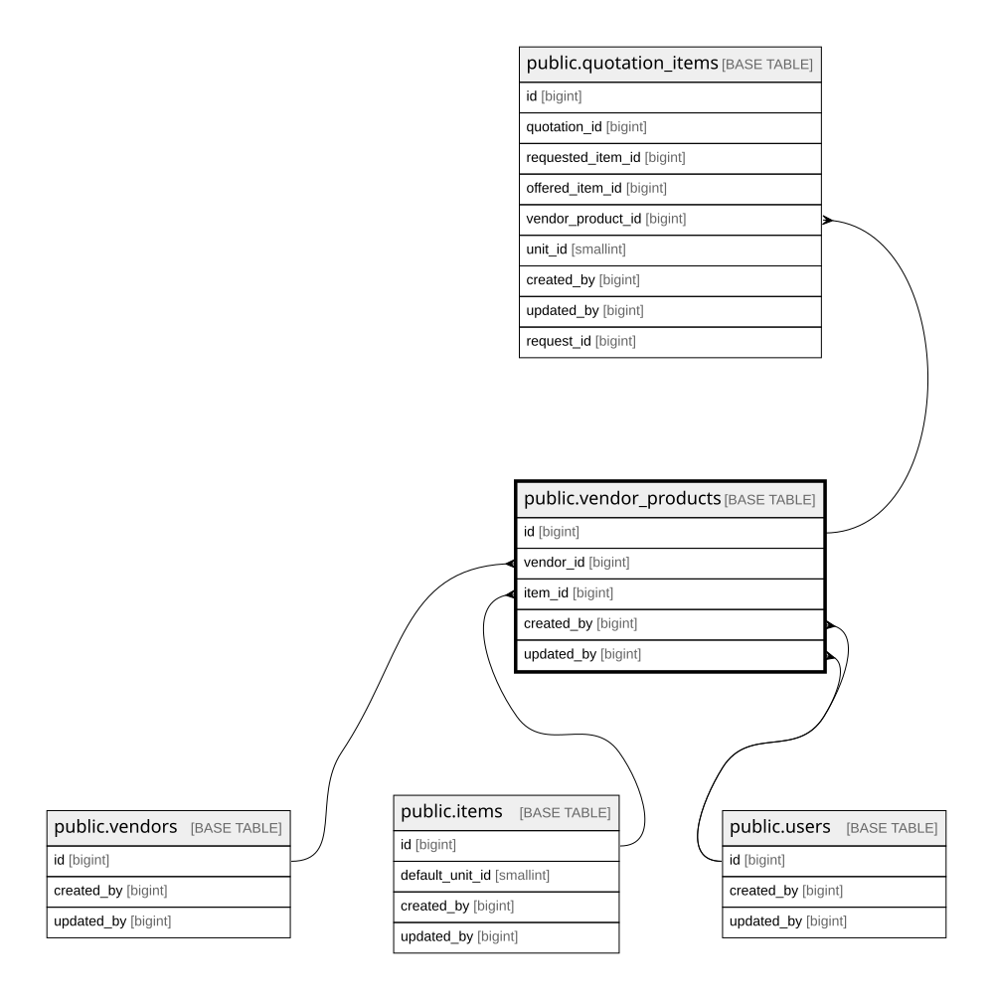

# public.vendor_products

## Columns

| Name           | Type                     | Default                                     | Nullable | Children                                            | Parents                             | Comment |
| -------------- | ------------------------ | ------------------------------------------- | -------- | --------------------------------------------------- | ----------------------------------- | ------- |
| id             | bigint                   | nextval('vendor_products_id_seq'::regclass) | false    | [public.quotation_items](public.quotation_items.md) |                                     |         |
| vendor_id      | bigint                   |                                             | false    |                                                     | [public.vendors](public.vendors.md) |         |
| item_id        | bigint                   |                                             | false    |                                                     | [public.items](public.items.md)     |         |
| vendor_sku     | varchar(100)             |                                             | true     |                                                     |                                     |         |
| cost_price     | numeric(15,2)            |                                             | false    |                                                     |                                     |         |
| last_quoted_at | timestamp with time zone |                                             | true     |                                                     |                                     |         |
| is_active      | boolean                  | true                                        | false    |                                                     |                                     |         |
| created_by     | bigint                   |                                             | false    |                                                     | [public.users](public.users.md)     |         |
| updated_by     | bigint                   |                                             | true     |                                                     | [public.users](public.users.md)     |         |
| created_at     | timestamp with time zone | now()                                       | false    |                                                     |                                     |         |
| updated_at     | timestamp with time zone | now()                                       | false    |                                                     |                                     |         |
| product_url    | text                     |                                             | true     |                                                     |                                     |         |

## Constraints

| Name                                  | Type        | Definition                                                        |
| ------------------------------------- | ----------- | ----------------------------------------------------------------- |
| vendor_products_cost_price_check      | CHECK       | CHECK ((cost_price >= (0)::numeric))                              |
| vendor_products_cost_price_not_null   | n           | NOT NULL cost_price                                               |
| vendor_products_created_at_not_null   | n           | NOT NULL created_at                                               |
| vendor_products_created_by_not_null   | n           | NOT NULL created_by                                               |
| vendor_products_id_not_null           | n           | NOT NULL id                                                       |
| vendor_products_is_active_not_null    | n           | NOT NULL is_active                                                |
| vendor_products_item_id_not_null      | n           | NOT NULL item_id                                                  |
| vendor_products_updated_at_not_null   | n           | NOT NULL updated_at                                               |
| vendor_products_vendor_id_not_null    | n           | NOT NULL vendor_id                                                |
| vendor_products_created_by_fkey       | FOREIGN KEY | FOREIGN KEY (created_by) REFERENCES users(id) ON DELETE RESTRICT  |
| vendor_products_updated_by_fkey       | FOREIGN KEY | FOREIGN KEY (updated_by) REFERENCES users(id) ON DELETE RESTRICT  |
| vendor_products_vendor_id_fkey        | FOREIGN KEY | FOREIGN KEY (vendor_id) REFERENCES vendors(id) ON DELETE RESTRICT |
| vendor_products_item_id_fkey          | FOREIGN KEY | FOREIGN KEY (item_id) REFERENCES items(id) ON DELETE RESTRICT     |
| vendor_products_pkey                  | PRIMARY KEY | PRIMARY KEY (id)                                                  |
| vendor_products_vendor_id_item_id_key | UNIQUE      | UNIQUE (vendor_id, item_id)                                       |

## Indexes

| Name                                  | Definition                                                                                                           |
| ------------------------------------- | -------------------------------------------------------------------------------------------------------------------- |
| vendor_products_pkey                  | CREATE UNIQUE INDEX vendor_products_pkey ON public.vendor_products USING btree (id)                                  |
| vendor_products_vendor_id_item_id_key | CREATE UNIQUE INDEX vendor_products_vendor_id_item_id_key ON public.vendor_products USING btree (vendor_id, item_id) |
| idx_vendor_products_vendor            | CREATE INDEX idx_vendor_products_vendor ON public.vendor_products USING btree (vendor_id)                            |
| idx_vendor_products_item              | CREATE INDEX idx_vendor_products_item ON public.vendor_products USING btree (item_id)                                |

## Triggers

| Name                           | Definition                                                                                                                                      |
| ------------------------------ | ----------------------------------------------------------------------------------------------------------------------------------------------- |
| trg_vendor_products_updated_at | CREATE TRIGGER trg_vendor_products_updated_at BEFORE UPDATE ON public.vendor_products FOR EACH ROW EXECUTE FUNCTION set_updated_at_no_version() |

## Relations

---

> Generated by [tbls](https://github.com/k1LoW/tbls)
