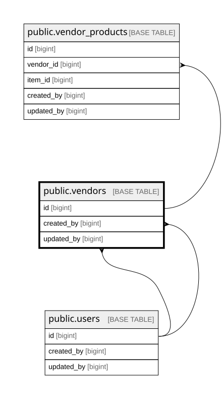

# public.vendors

## Columns

| Name            | Type                     | Default                             | Nullable | Children                                            | Parents                         | Comment                                                               |
| --------------- | ------------------------ | ----------------------------------- | -------- | --------------------------------------------------- | ------------------------------- | --------------------------------------------------------------------- |
| id              | bigint                   | nextval('vendors_id_seq'::regclass) | false    | [public.vendor_products](public.vendor_products.md) |                                 |                                                                       |
| name            | varchar(255)             |                                     | false    |                                                     |                                 |                                                                       |
| location        | varchar(255)             |                                     | true     |                                                     |                                 |                                                                       |
| contact_info    | jsonb                    |                                     | true     |                                                     |                                 |                                                                       |
| is_active       | boolean                  | true                                | false    |                                                     |                                 |                                                                       |
| created_by      | bigint                   |                                     | false    |                                                     | [public.users](public.users.md) |                                                                       |
| updated_by      | bigint                   |                                     | true     |                                                     | [public.users](public.users.md) |                                                                       |
| created_at      | timestamp with time zone | now()                               | false    |                                                     |                                 |                                                                       |
| updated_at      | timestamp with time zone | now()                               | false    |                                                     |                                 |                                                                       |
| logo_object_key | text                     |                                     | true     |                                                     |                                 | MinIO object key inside bucket vendor-logos. NULL = no logo uploaded. |

## Constraints

| Name                        | Type        | Definition                                                       |
| --------------------------- | ----------- | ---------------------------------------------------------------- |
| vendors_created_at_not_null | n           | NOT NULL created_at                                              |
| vendors_created_by_not_null | n           | NOT NULL created_by                                              |
| vendors_id_not_null         | n           | NOT NULL id                                                      |
| vendors_is_active_not_null  | n           | NOT NULL is_active                                               |
| vendors_name_not_null       | n           | NOT NULL name                                                    |
| vendors_updated_at_not_null | n           | NOT NULL updated_at                                              |
| vendors_created_by_fkey     | FOREIGN KEY | FOREIGN KEY (created_by) REFERENCES users(id) ON DELETE RESTRICT |
| vendors_updated_by_fkey     | FOREIGN KEY | FOREIGN KEY (updated_by) REFERENCES users(id) ON DELETE RESTRICT |
| vendors_pkey                | PRIMARY KEY | PRIMARY KEY (id)                                                 |

## Indexes

| Name                  | Definition                                                                         |
| --------------------- | ---------------------------------------------------------------------------------- |
| vendors_pkey          | CREATE UNIQUE INDEX vendors_pkey ON public.vendors USING btree (id)                |
| idx_vendors_name_trgm | CREATE INDEX idx_vendors_name_trgm ON public.vendors USING gin (name gin_trgm_ops) |

## Triggers

| Name                   | Definition                                                                                                                      |
| ---------------------- | ------------------------------------------------------------------------------------------------------------------------------- |
| trg_vendors_updated_at | CREATE TRIGGER trg_vendors_updated_at BEFORE UPDATE ON public.vendors FOR EACH ROW EXECUTE FUNCTION set_updated_at_no_version() |

## Relations

---

> Generated by [tbls](https://github.com/k1LoW/tbls)
